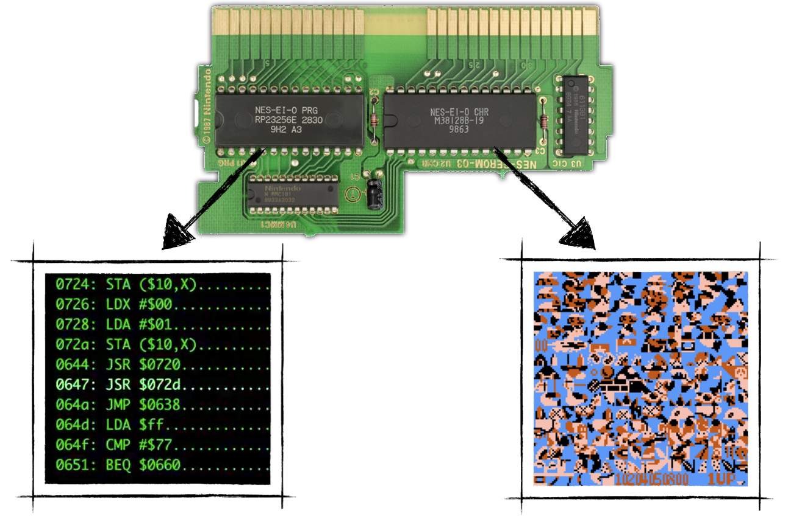

## Architecture

The simplified architecture of hardware-software interaction looks like this:

From top to bottom:

* Applications are running business logic and interact with hardware through an Operating System.
* The Operating System communicates with the hardware using machine language.
* On a hardware level, each device can be seen as an array of memory elements, processing units, or both. From this perspective, NES joypad is nothing more than an array of eight 1-bit items, each representing a pressed/released state of a button
* Layers below ALU and Memory elements are less of an interest to us. On a hardware level, it all comes down to logic gates and their arrangements.

> If you want to get intimate knowledge of how computers are composed, starting from the basic principles of boolean logic,
> I highly recommend the book: ["The Elements of Computing Systems. Building a Modern Computer from First Principles"](https://www.goodreads.com/book/show/910789.The_Elements_of_Computing_Systems) by Noam Nisan, Shimon Schocken.

Luckily for us, NES doesn't have an Operating System. That means that the Application layer (Gamezzz) communicates with hardware directly using machine language.

The simplified version of this layered architecture looks like this:

As you can see, machine language is the interface between our emulator and our NES games.

In the coming emulator, we would need to implement NES Computer Architecture, Arithmetic Logic Unit, and Memory. By using high-level language, we don't need to worry about simulating boolean arithmetic and sequential logic. Instead, we should rely on existing Rust features and language constructs.

## NES Platform Main Components

The significantly simplified schema of main NES hardware components:

* Central Processing Unit (**CPU**) - the NES's 2A03 is a modified version of the [6502 chip](https://en.wikipedia.org/wiki/MOS_Technology_6502). As with any CPU, the goal of this module is to execute the main program instructions.

* Picture Processing Unit (**PPU**) - was based on the 2C02 chip made by Ricoh, the same company that made CPU. This module's primary goal is to draw the current state of a game on a TV Screen.

* Both CPU and PPU have access to their 2 KiB (2048 bytes) banks of Random Access Memory (**RAM**)

* Audio Processing Unit (**APU**) - the module is a part of 2A03 chip and is responsible for generating specific five-channel based sounds, that made NES chiptunes so recognizable.

* Cartridges - were an essential part of the platform because the console didn't have an operating system. Each cartridge carried at least two large ROM chips - the Character ROM (CHR ROM) and the Program ROM (PRG ROM). The former stored a game's video graphics data, the latter stored CPU instructions - the game's code.
(in reality, when a cartridge is inserted into the slot CHR Rom is connected directly to PPU, while PRG Rom is connected directly to CPU)
The later version of cartridges carried additional hardware (ROM and RAM) accessible through so-called mappers. That explains why later games had provided significantly better gameplay and visuals despite running on the same console hardware.

* Gamepads - have a distinct goal to read inputs from a gamer and make it available for game logic. As we will see later, the fact that the gamepad for the 8-bit platform has only eight buttons is not a coincidence.

What's interesting is that CPU, PPU, and APU are independent of each other. This fact makes NES a distributed system in which separate components have to coordinate to generate one seamless gaming experience.

We can use the schema of the main NES components as an implementation plan for our emulator.

We have to build a simulation of all of these modules. The goal is to have something playable as soon as possible. Using an iterative approach, we will incrementally add features to achieve this goal.

Roughly estimating the effort required for each component, PPU will be the hardest, and the BUS the easiest.

Writing a perfect emulator is a never-ending quest. But this quest has a start, and we will start by emulating the CPU.

