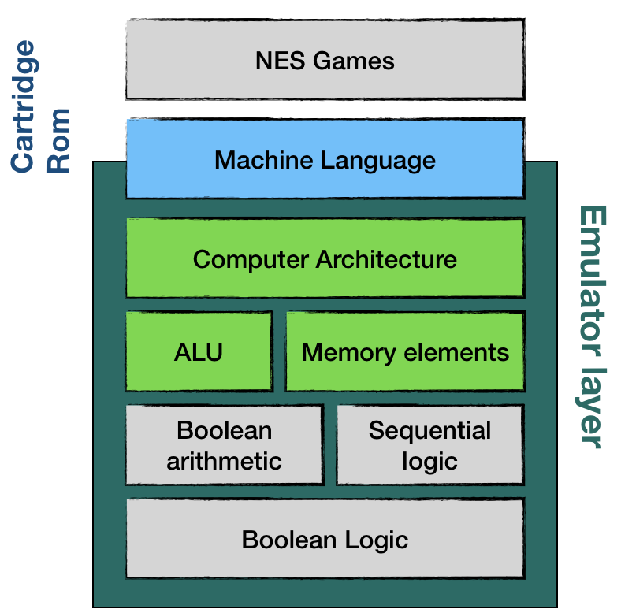
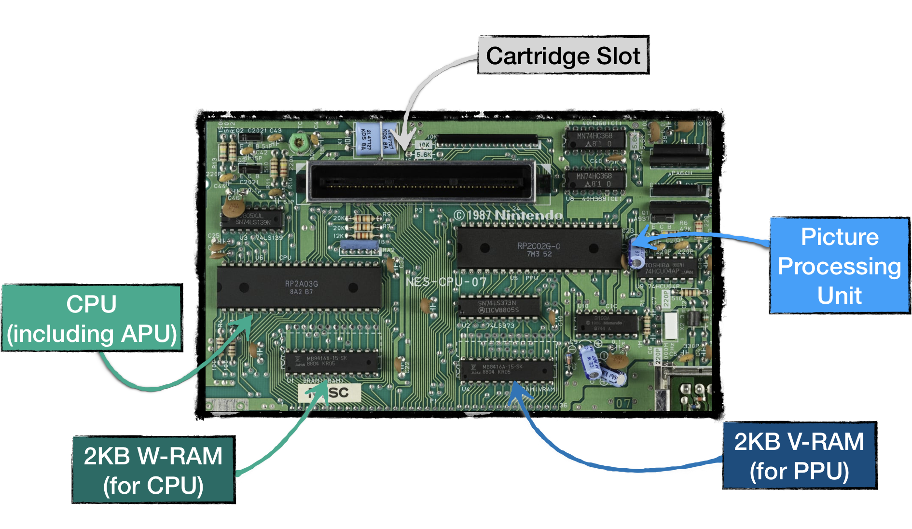
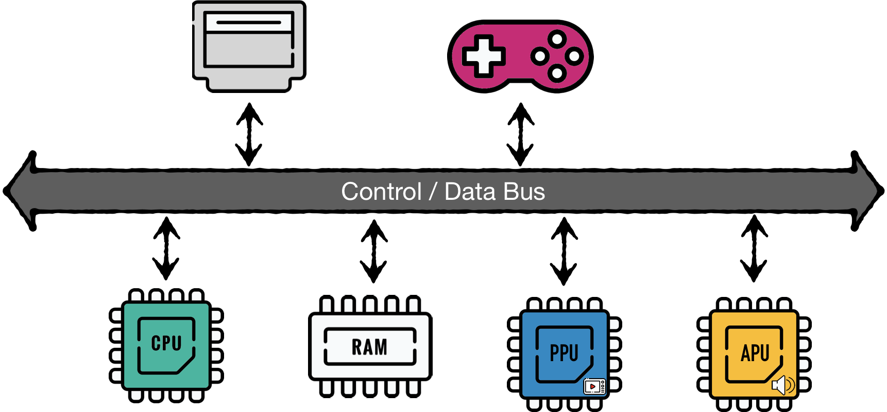
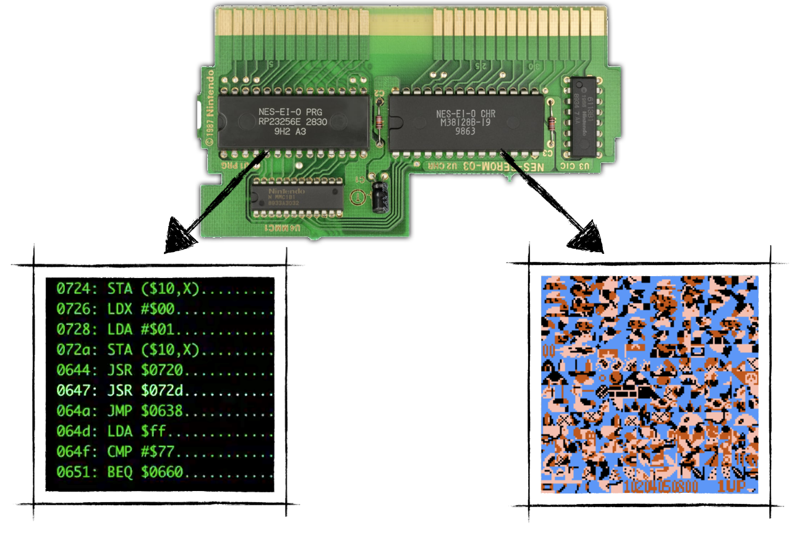
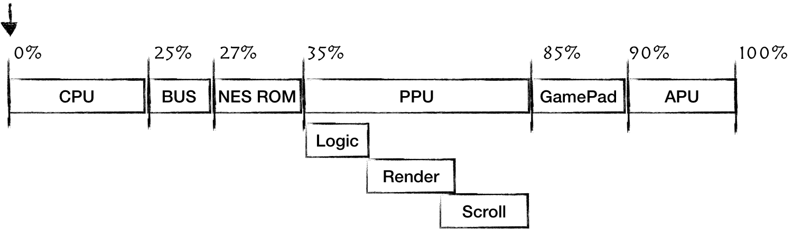

## 系统架构

软硬件交互的简化架构如下所示：

从上到下分别是：

* Applications are running business logic and interact with hardware through an Operating System.
* The Operating System communicates with the hardware using machine language.
* On a hardware level, each device can be seen as an array of memory elements, processing units, or both. From this perspective, NES joypad is nothing more than an array of eight 1-bit items, each representing a pressed/released state of a button
* Layers below ALU and Memory elements are less of an interest to us. On a hardware level, it all comes down to logic gates and their arrangements.

> If you want to get intimate knowledge of how computers are composed, starting from the basic principles of boolean logic,
> I highly recommend the book: ["The Elements of Computing Systems. Building a Modern Computer from First Principles"](https://www.goodreads.com/book/show/910789.The_Elements_of_Computing_Systems) by Noam Nisan, Shimon Schocken.

幸运的是，NES 没有操作系统。这意味着应用层直接使用机器语言与硬件进行通信。

简化版的系统架构图如下所示：

如您所见，机器语言是我们的模拟器和我们的 NES 游戏之间的接口。

接下来，我们需要实现 NES 计算机体系结构、算术逻辑单元和内存。
通过使用高级语言，我们无需担心模拟布尔算术和顺序逻辑。
相反，我们应该依赖现有的 Rust 特性和语言结构。

## 主要组成部件

NES主要硬件组件：

* **CPU** -
  NES 的 2A03 是 [6502 芯片](https://en.wikipedia.org/wiki/MOS_Technology_6502) 的修改版本。像所有CPU一样，该模块的目标是执行主程序指令。

* **PPU** -
  基于理光制造的2C02芯片，和CPU是同一家公司。该模块的主要目标是在电视屏幕上绘制游戏的当前状态。相当于显卡。

* **RAM** -
  Both CPU and PPU have access to their 2 KiB (2048 bytes) banks of Random Access Memory

* **APU** -
  该模块是 2A03 芯片（CPU）的一部分，负责生成特定的基于五通道的声音。用于合成游戏音乐。

* **Cartridges** -
  卡带是平台的重要组成部分。
  每个卡带至少带有两个大型 ROM 芯片：字符ROM(CHR ROM) 和 程序ROM(PRG ROM)。
  前者存储游戏的视频图形数据，后者存储CPU指令，即游戏的代码。
  实际上，当卡带插入插槽时，CHR ROM 直接连接到 PPU，而 PRG ROM 直接连接到 CPU。

  较新版本的卡带有可通过 Mapper 访问到附加硬件（ROM 和 RAM）。
  这就解释了为什么尽管在相同的硬件上运行，后来的游戏却提供了明显更好的游戏玩法和视觉效果。

  

* **Gamepads** -
  游戏手柄的作用是从玩家那里读取输入并使其可用于游戏逻辑。（8位平台的游戏手柄只有八个按钮这一事实并非巧合）

有趣的是 CPU、PPU 和 APU 是相互独立的。这使 NES 成为一个分布式系统，其中单独的组件必须协调才能产生无缝的游戏体验。

我们根据 NES 的主要组件分割我们的开发计划：

我们必须对所有模块进行模拟，但是我们的目标是尽快有一些可玩的东西，所以使用迭代方法，我们将逐步添加功能以实现此目标。

粗略估计每个组件所需的工作量，PPU 将是最难的，而 BUS 是最简单的。

编写一个完美的模拟器是一个永无止境的追求。但是这个任务有一个简单的开始，我们将从模拟 CPU 开始。
