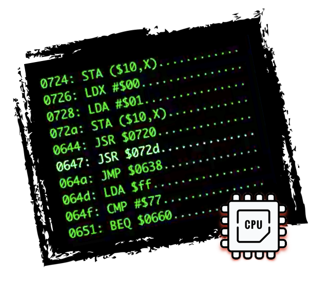
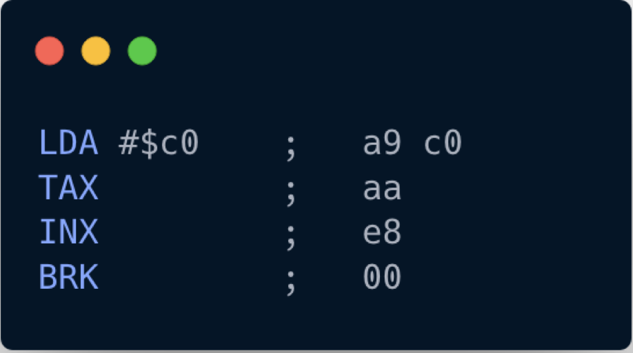
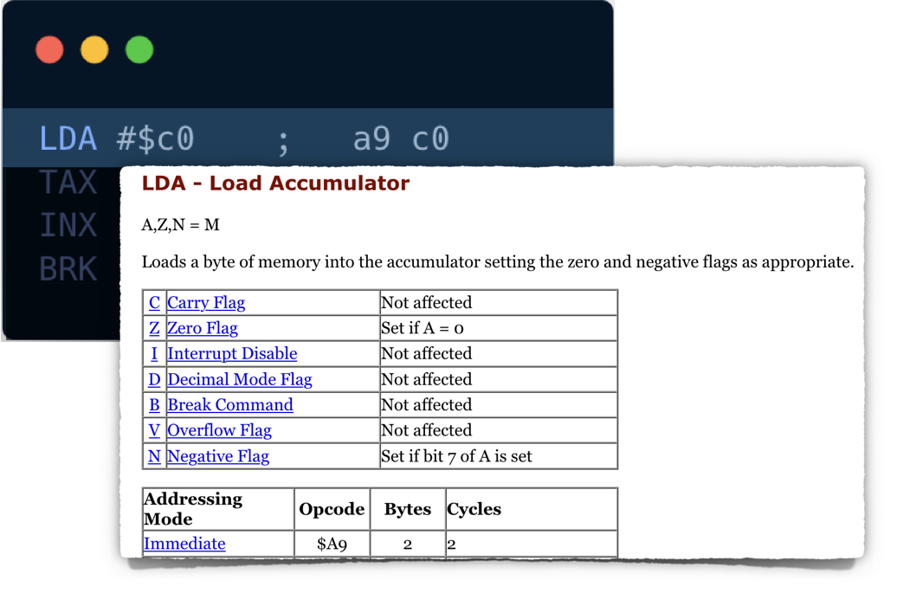
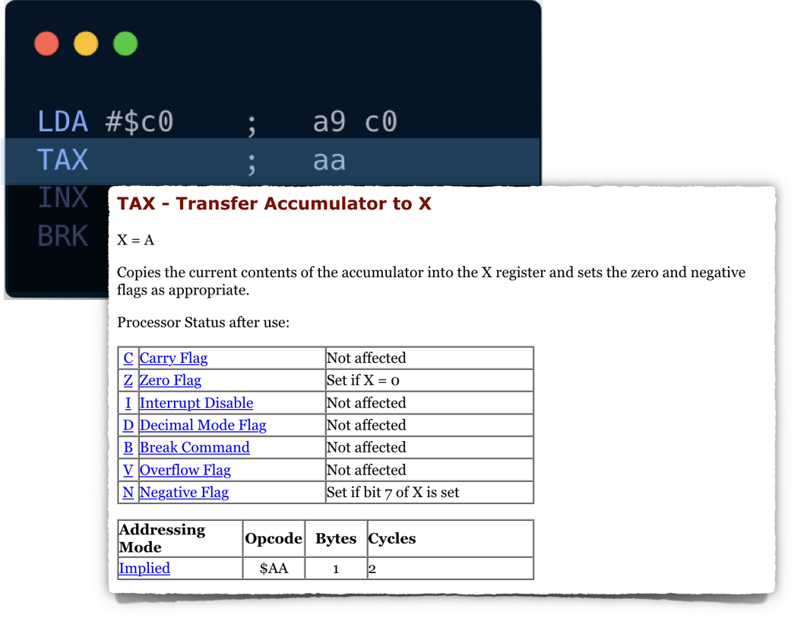
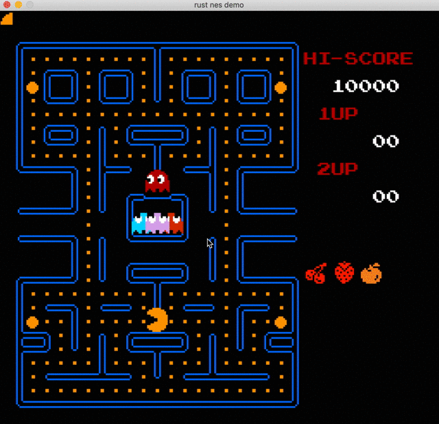

让我们尝试运行我们的第一个程序。该程序如下所示：

```hex
a9 c0 aa e8 00
```

这有点神秘，因为它不是为人类阅读而设计的。如果我们用[汇编代码](https://en.wikipedia.org/wiki/Assembly_language)表示程序，我们可以更容易地破译发生了什么：



现在它更具可读性：它由 4 条指令组成，第一条指令有一个参数。

让我们通过引用 [6502 指令参考](https://www.masswerk.at/6502/6502_instruction_set.html#LDA)中的操作码来解释发生了什么



看起来该命令将十六进制值 `0xC0` 加载到累加器寄存器中。
它还必须更新处理器状态寄存器 P 中的一些位（零标志和负标志）。

> **LDA** 规范显示操作码 `0xA9` 有一个参数。
> 指令大小为 2 个字节：一个字节用于操作码本身（所有 NES CPU 操作码的标准），另一个用于参数。
>
> NES 操作码可以没有显式参数或一个显式参数。对于某些操作，显式参数可以占用 2 个字节。在这种情况下，机器指令将占用 3 个字节。
>
> 值得一提的是，有些操作使用 CPU 寄存器作为隐式参数。(如INX)

让我们从高层次的角度勾勒出我们的 CPU 的样子：

```rust
pub struct CPU {
  pub register_a: u8,
  pub status: u8,
  pub program_counter: u16,
}

impl CPU {
  pub fn new() -> Self {
    CPU {
      register_a: 0,
      status: 0,
      program_counter: 0,
    }
  }

  pub fn interpret(&mut self, program: Vec<u8>) {
    todo!("")
  }
}
```

请注意，我们引入了一个程序计数器寄存器，它将帮助我们跟踪我们在程序中的当前位置。
另外，`interpret` 方法采用对 self 的可变引用，因为我们知道我们需要在执行期间修改 `register_a`。

CPU 以恒定周期工作：

* 从指令存储器中取出下一条执行指令
* 解码指令
* 执行指令
* 重复此循环

OK，让我们尝试准确地编码：

```rust
pub fn interpret(&mut self, program: Vec<u8>) {
  self.program_counter = 0;

  loop {
    let opscode = program[self.program_counter as usize];
    self.program_counter += 1;

    match opscode {
      _ => todo!()
    }
  }
}
```

到现在为止还挺好。你可能注意到了无限循环？不，会没事的。现在让我们实现 LDA (0xA9) 操作码：

```rust
match opscode {
  0xA9 => {
    let param = program[self.program_counter as usize];
    self.program_counter +=1;
    self.register_a = param;

    if self.register_a == 0 {
      self.status = self.status | 0b0000_0010;
    } else {
      self.status = self.status & 0b1111_1101;
    }

    if self.register_a & 0b1000_0000 != 0 {
      self.status = self.status | 0b1000_0000;
    } else {
      self.status = self.status & 0b0111_1111;
    }
  }
  _ => todo!()
}
```

我们在这里并没有做任何疯狂的事情，只是遵循规范并使用 rust 结构进行二进制算术。

> 根据结果设置或取消设置 CPU 标志状态至关重要。

由于无限循环，我们还不能测试这个功能。在继续之前，让我们快速实现 **BRK (0x00)** 操作码：

```rust
match opcode {
  // ...
  0x00 => {
    return;
  }
  _ => todo!()
}
```

现在让我们编写一些测试：

```rust
#[cfg(test)]
mod test {
  use super::*;

  #[test]
  fn test_0xa9_lda_immidiate_load_data() {
    let mut cpu = CPU::new();
    cpu.interpret(vec![0xa9, 0x05, 0x00]);
    assert_eq!(cpu.register_a, 0x05);
    assert!(cpu.status & 0b0000_0010 == 0b00);
    assert!(cpu.status & 0b1000_0000 == 0);
  }

  #[test]
  fn test_0xa9_lda_zero_flag() {
    let mut cpu = CPU::new();
    cpu.interpret(vec![0xa9, 0x00, 0x00]);
    assert!(cpu.status & 0b0000_0010 == 0b10);
  }
}
```

> 你认为这就够了吗？我们还应该检查什么？

好的。让我们尝试实现另一个操作码，准备好了么？



这也很简单：将值从 A 复制到 X，并更新状态寄存器。

我们需要在我们的 CPU 结构中引入 **register_x**，然后我们可以实现 **TAX (0xAA)** 操作码：

```rust
pub struct CPU {
  //...
  pub register_x: u8,
}

impl CPU {
  // ...
  pub fn interpret(&mut self, program: Vec<u8>) {
  // ...
    match opscode {
      //...
      0xAA =>  {
        self.register_x = self.register_a;
        if self.register_x == 0 {
          self.status = self.status | 0b0000_0010;
        } else {
          self.status = self.status & 0b1111_1101;
        }

        if self.register_x & 0b1000_0000 != 0 {
          self.status = self.status | 0b1000_0000;
        } else {
          self.status = self.status & 0b0111_1111;
        }
      }
    }
  }
}
```

不要忘记编写测试用例：

```rust
#[test]
fn test_0xaa_tax_move_a_to_x() {
  let mut cpu = CPU::new();
  cpu.register_a = 10;
  cpu.interpret(vec![0xaa, 0x00]);

  assert_eq!(cpu.register_x, 10)
}
```

在开始编写下一个操作码之前，我们必须承认我们的代码非常复杂：

* 解释方法已经很复杂并且做了很多事情
* `TAX` 和 `LDA` 的实现方式有明显的重复。

让我们优化一下：

```rust
// ...
fn lda(&mut self, value: u8) {
  self.register_a = value;
  self.update_zero_and_negative_flags(self.register_a);
}

fn tax(&mut self) {
  self.register_x = self.register_a;
  self.update_zero_and_negative_flags(self.register_x);
}

fn update_zero_and_negative_flags(&mut self, result: u8) {
  if result == 0 {
    self.status = self.status | 0b0000_0010;
  } else {
      self.status = self.status & 0b1111_1101;
  }

  if result & 0b1000_0000 != 0 {
    self.status = self.status | 0b1000_0000;
  } else {
    self.status = self.status & 0b0111_1111;
  }
}

// ...

pub fn interpret(&mut self, program: Vec<u8>) {
  // ...
  match opscode {
    0xA9 => {
      let param = program[self.program_counter as usize];
      self.program_counter += 1;
      self.lda(param);
    }
    0xAA => self.tax(),
    0x00 => return,
    _ => todo!(),
  }
}
```

好了。代码现在看起来更易于管理。希望所有测试仍然通过。

我必须特别强调为我们正在实现的所有操作码编写测试的重要性。
操作本身几乎是微不足道的，但微小的错误可能会在游戏逻辑中引起不可预知的后果。



实现最后一个操作码应该不是问题，我将把这个练习留给你。
完成后，应该可以通过这些测试。

```rust
#[test]
fn test_5_ops_working_together() {
  let mut cpu = CPU::new();
  cpu.interpret(vec![0xa9, 0xc0, 0xaa, 0xe8, 0x00]);

  assert_eq!(cpu.register_x, 0xc1)
}

#[test]
fn test_inx_overflow() {
  let mut cpu = CPU::new();
  cpu.register_x = 0xff;
  cpu.interpret(vec![0xe8, 0xe8, 0x00]);

  assert_eq!(cpu.register_x, 1)
}
```

---

> 本章完整源代码：[GitHub](https://github.com/bugzmanov/nes_ebook/tree/master/code/ch3.1)
