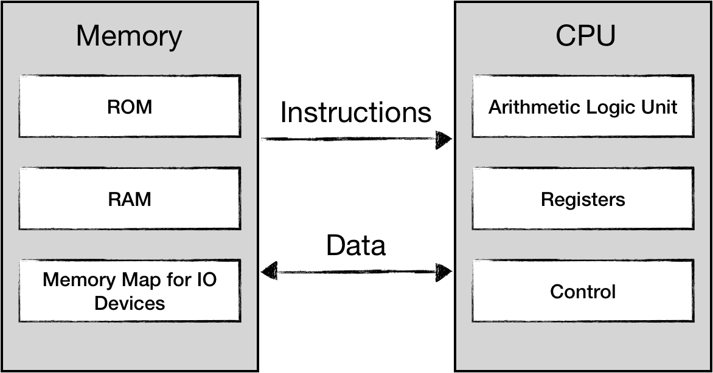
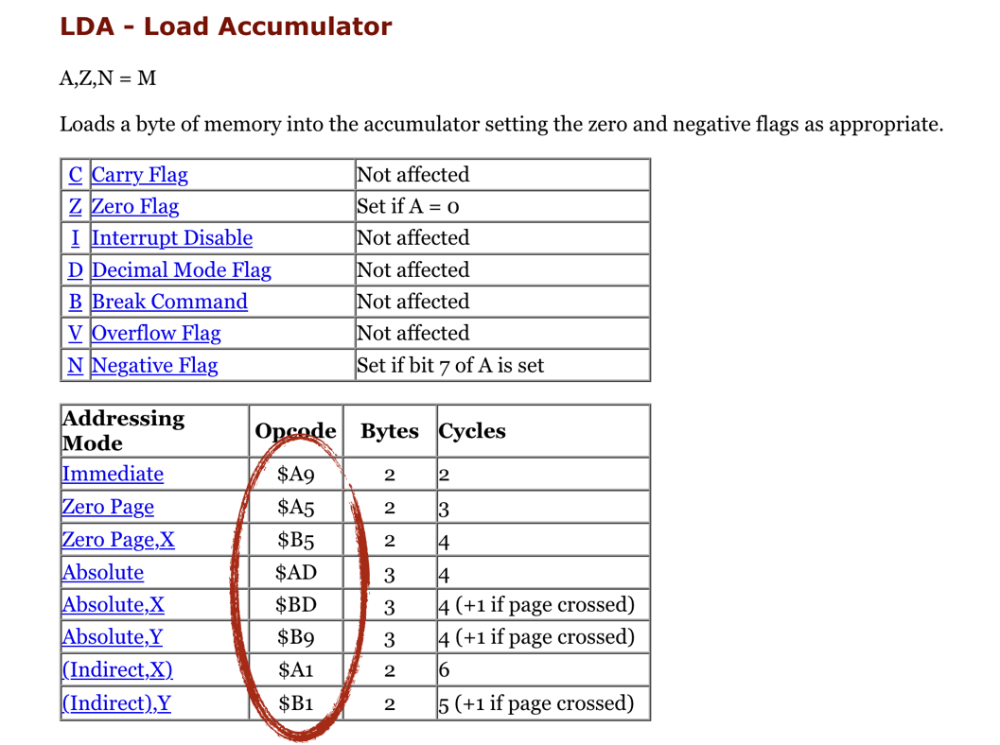
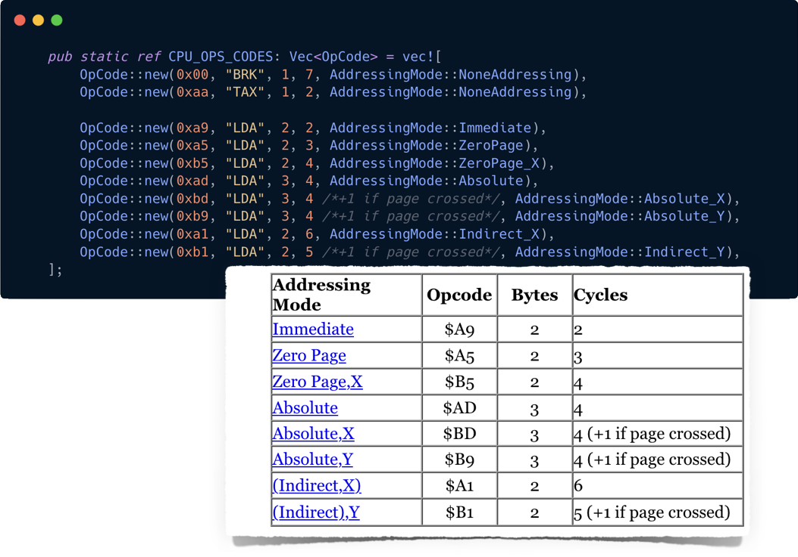

在我们上一章的实现中，CPU 接收指令作为单独的输入，这不是实际 NES 中的工作方式。

NES 实现了典型的冯诺依曼架构：数据和指令都存储在内存中。
从 CPU 的角度来看，执行的代码是数据，任何数据都可能被解释为可执行代码。
CPU 无法区分数据还是指令。 CPU 拥有的唯一机制是一个 `program_counter` 寄存器，用于跟踪指令流中的位置。



让我们在我们的 CPU 代码中勾勒出来：

```rust
pub struct CPU {
  pub register_a: u8,
  pub register_x: u8,
  pub status: u8,
  pub program_counter: u16,
  memory: [u8; 0xFFFF]
}

impl CPU {

  fn mem_read(&self, addr: u16) -> u8 {
    self.memory[addr as usize]
  }

  fn mem_write(&mut self, addr: u16, data: u8) {
    self.memory[addr as usize] = data;
  }

  pub fn load_and_run(&mut self, program: Vec<u8>) {
    self.load(program);
    self.run()
  }

  pub fn load(&mut self, program: Vec<u8>) {
    self.memory[0x8000 .. (0x8000 + program.len())].copy_from_slice(&program[..]);
    self.program_counter = 0x8000;
  }

  pub fn run(&mut self) {
    // note: we move initialization of program_counter from here to load function
    loop {
      let opscode = self.mem_read(self.program_counter);
      self.program_counter += 1;

      match opscode {
        //..
      }
    }
  }
}
```

我们刚刚为整个 64 KiB 的地址空间创建了一个数组。正如在下一章中讨论的那样，CPU 只有 2 KiB 的 RAM，其他所有内容都保留用于内存映射。

我们将程序代码加载到内存中，从 `0x8000` 地址开始。
我们已经讨论过 **[0x8000 ... 0xFFFF]** 是为 Program ROM 保留的，我们可以假设指令流应该在这个空间的某个地方开始（不一定在 0x8000）。

NES 平台有一个特殊的机制来标记 CPU 应该从哪里开始执行。
插入新磁带后，CPU 会收到一个称为 **Reset interrupt** 的特殊信号，指示 CPU：

* 重置状态（寄存器和标志）
* 将 `program_counter` 设置为存储在 `0xFFFC` 的 16 位地址

在实现之前，我应该简单提一下 NES CPU 可以寻址 65536 个内存单元。
存储一个地址需要 2 个字节。 NES CPU 使用 Little-Endian 寻址而不是 Big-Endian。
这意味着地址的 8 个最低有效位将存储在 8 个最高有效位之前。

为了说明区别：

| |  |
|-|-:|
| 真实地址 | **0x8000** |
| big-endian | **80 00** |
| little-endian | **00 80** |

例如，将数据从内存单元 `0x8000` 读取到 A 寄存器的指令如下所示：

```text
LDA $8000      <=>    ad 00 80
```

我们可以使用 Rust 的一些位运算来实现这种行为：

```rust
fn mem_read_u16(&mut self, pos: u16) -> u16 {
  let lo = self.mem_read(pos) as u16;
  let hi = self.mem_read(pos + 1) as u16;
  (hi << 8) | (lo as u16)
}

fn mem_write_u16(&mut self, pos: u16, data: u16) {
  let hi = (data >> 8) as u8;
  let lo = (data & 0xff) as u8;
  self.mem_write(pos, lo);
  self.mem_write(pos + 1, hi);
}
```

或者使用 Rust 的 [endian support for primitive types](https://doc.rust-lang.org/std/primitive.u16.html#method.from_le_bytes).

现在我们可以正确实现 **reset** 功能了。我们将不得不调整 `load` 和 `load_and_run` 函数：

* **load** 方法应该将程序加载到 PRG ROM 空间并将对代码的引用保存到 0xFFFC 存储单元
* **reset** 方法应该恢复所有寄存器的状态，并通过存储在 `0xFFFC` 的 2 字节值初始化 `program_counter`

```rust
pub fn reset(&mut self) {
  self.register_a = 0;
  self.register_x = 0;
  self.status = 0;

  self.program_counter = self.mem_read_u16(0xFFFC);
}

pub fn load(&mut self, program: Vec<u8>) {
  self.memory[0x8000 .. (0x8000 + program.len())].copy_from_slice(&program[..]);
  self.mem_write_u16(0xFFFC, 0x8000);
}

pub fn load_and_run(&mut self, program: Vec<u8>) {
  self.load(program);
  self.reset();
  self.run()
}
```

不要忘记现在修复失败的测试！

好吧，这是最容易的部分。

还记得我们上一章实现的 `LDA` 操作码吗？根据参数的类型，该单个助记符 (LDA) 实际上可以翻译成 8 种不同的机器指令：



您可以阅读有关寻址模式的信息：

* [here](https://skilldrick.github.io/easy6502/#addressing)
* and [here](https://www.masswerk.at/6502/6502_instruction_set.html)

简而言之，寻址模式是指令的一个属性，它定义了 CPU 应该如何解释指令流中接下来的 1 或 2 个字节。

不同的寻址方式有不同的指令大小，例如：

* **Zero Page version** ($A5) 大小为 2 个字节，一个用于操作码本身，一个用于参数。这就是为什么零页寻址不能引用前 255 个字节以上的内存。
* **Absolute version** ($AD) 有 3 个字节，地址占用 2 个字节，因此可以引用所有 65536 个存储单元。 （注意：2字节的参数将根据little-endian规则）

没有占用超过 3 个字节的操作码。 CPU 指令大小可以是 1、2 或 3 个字节。

大多数 CPU 指令提供不止一种寻址方式。理想情况下，我们不想为每条 CPU 指令重新实现相同的寻址模式逻辑。

让我们尝试编写 CPU 应该如何解释不同的寻址模式：

```rust
#[derive(Debug)]
#[allow(non_camel_case_types)]
pub enum AddressingMode {
  Immediate,
  ZeroPage,
  ZeroPage_X,
  ZeroPage_Y,
  Absolute,
  Absolute_X,
  Absolute_Y,
  Indirect_X,
  Indirect_Y,
  NoneAddressing,
}

impl CPU {
  // ...
  fn get_operand_address(&self, mode: &AddressingMode) -> u16 {
    match mode {
      AddressingMode::Immediate => self.program_counter,

      AddressingMode::ZeroPage  => self.mem_read(self.program_counter) as u16,

      AddressingMode::Absolute => self.mem_read_u16(self.program_counter),

      AddressingMode::ZeroPage_X => {
        let pos = self.mem_read(self.program_counter);
        let addr = pos.wrapping_add(self.register_x) as u16;
        addr
      }

      AddressingMode::ZeroPage_Y => {
        let pos = self.mem_read(self.program_counter);
        let addr = pos.wrapping_add(self.register_y) as u16;
        addr
      }

      AddressingMode::Absolute_X => {
        let base = self.mem_read_u16(self.program_counter);
        let addr = base.wrapping_add(self.register_x as u16);
        addr
      }

      AddressingMode::Absolute_Y => {
        let base = self.mem_read_u16(self.program_counter);
        let addr = base.wrapping_add(self.register_y as u16);
        addr
      }

      AddressingMode::Indirect_X => {
        let base = self.mem_read(self.program_counter);

        let ptr: u8 = (base as u8).wrapping_add(self.register_x);
        let lo = self.mem_read(ptr as u16);
        let hi = self.mem_read(ptr.wrapping_add(1) as u16);
        (hi as u16) << 8 | (lo as u16)
      }

      AddressingMode::Indirect_Y => {
        let base = self.mem_read(self.program_counter);

        let lo = self.mem_read(base as u16);
        let hi = self.mem_read((base as u8).wrapping_add(1) as u16);
        let deref_base = (hi as u16) << 8 | (lo as u16);
        let deref = deref_base.wrapping_add(self.register_y as u16);
        deref
      }

      AddressingMode::NoneAddressing => {
        panic!("mode {:?} is not supported", mode);
      }
    }
  }
}
```

这样，我们就可以改变我们最初的 `LDA` 实现。

```rust
fn lda(&mut self, mode: &AddressingMode) {
  let addr = self.get_operand_address(mode);
  let value = self.mem_read(addr);

  self.register_a = value;
  self.update_zero_and_negative_flags(self.register_a);
}

pub fn run(&mut self) {
  loop {
    let code = self.mem_read(self.program_counter);
    self.program_counter += 1;

    match code {
      0xA9 => {
        self.lda(&AddressingMode::Immediate);
        self.program_counter += 1;
      }
      0xA5 => {
        self.lda(&AddressingMode::ZeroPage);
        self.program_counter += 1;
      }
      0xAD => {
        self.lda(&AddressingMode::Absolute);
        self.program_counter += 2;
      }
      //....
    }
  }
}
```

注意：从指令流中读取每个字节后递增 `program_counter` 非常重要。

不要忘记更新或添加测试用例：

```rust
#[test]
fn test_lda_from_memory() {
  let mut cpu = CPU::new();
  cpu.mem_write(0x10, 0x55);

  cpu.load_and_run(vec![0xa5, 0x10, 0x00]);

  assert_eq!(cpu.register_a, 0x55);
}
```

在此基础之上，我们可以快速实现 `STA` 指令，将寄存器 A 的值复制到内存中。

```rust
fn sta(&mut self, mode: &AddressingMode) {
  let addr = self.get_operand_address(mode);
  self.mem_write(addr, self.register_a);
}

pub fn run(&mut self) {
  //...
  match code {
    //..
    /* STA */
    0x85 => {
      self.sta(AddressingMode::ZeroPage);
      self.program_counter += 1;
    }

    0x95 => {
      self.sta(AddressingMode::ZeroPage_X);
      self.program_counter += 1;
    }
    //..
  }
}
```

在我们结束之前，我想提一下当前的 `run` 方法的一些缺陷，原因有几个。
首先，在某些操作之后将 program_counter 增加 1（或 2）的操作很容易出错。如果我们犯了一个错误，就很难发现它。

其次，如果我们可以将所有 **LDA** 操作分组到一个 `match` 语句下，岂不是更易读、更方便？

最后，我们所做的就是将指令规范硬编码到 Rust 代码中。以某种表格形式保存代码看起来是一种更易于管理的方法。



我留给你弄清楚如何达到这一点。

------

> 本章节代码: [GitHub](https://github.com/bugzmanov/nes_ebook/tree/master/code/ch3.2)
