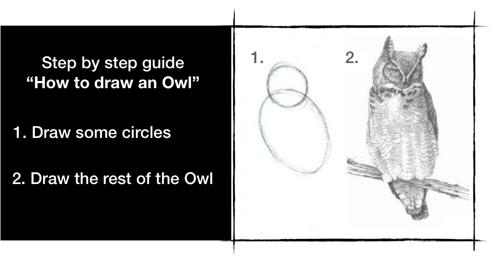

手把手教你画一只猫头鹰：

1. 第一步画出来两个圆圈
2. 继续画出来剩余的部分

实现其余的 6502 CPU 指令应该相对简单。我不会详细介绍每一个指令的实现。

不过这里有一些提示：

* **ADC**
  从逻辑流的角度来看，这可能是最复杂的指令。
  请注意，该规范包含有关可以完全跳过的十进制模式的详细信息，因为该芯片的 Ricoh 修改不支持十进制模式。

  > 本文详细介绍了如何在 6502 中实现二进制算术：6502 溢出标志以数学方式解释：[The 6502 overflow flag explained mathematically](http://www.righto.com/2012/12/the-6502-overflow-flag-explained.html)
  >
  > 对于好奇和勇敢的灵魂： [The 6502 CPU's overflow flag explained at the silicon level](http://www.righto.com/2013/01/a-small-part-of-6502-chip-explained.html)

* 实现 ADC 后，实现 SBC 变得微不足道，因为 `A - B = A + (-B)`， `-B = !B + 1`

* **PHP**, **PLP** 和 **RTI** 必须处理 [2 位 B 标志](http://wiki.nesdev.com/w/index.php/Status_flags#The_B_flag).
  除了中断执行之外，这些是唯一直接影响（或直接受其影响）状态寄存器 P 的第 5 位的命令。

* 大部分的跳转和跳转操作都可以通过简单的修改 `program_counter` 寄存器来实现。
  但是，请注意不要在同一指令解释周期内递增寄存器。

如果你卡住了，你可以随时在[这里](https://github.com/bugzmanov/nes_ebook/tree/master/code/ch3.3)查找 6502 指令集的实现。

------

> 本章代码: [GitHub](https://github.com/bugzmanov/nes_ebook/tree/master/code/ch3.3)
