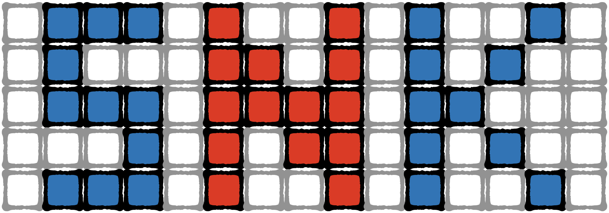
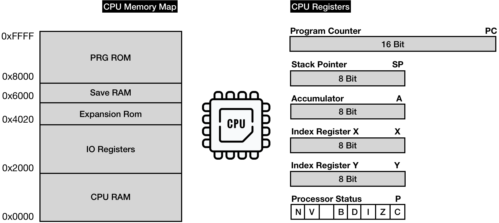
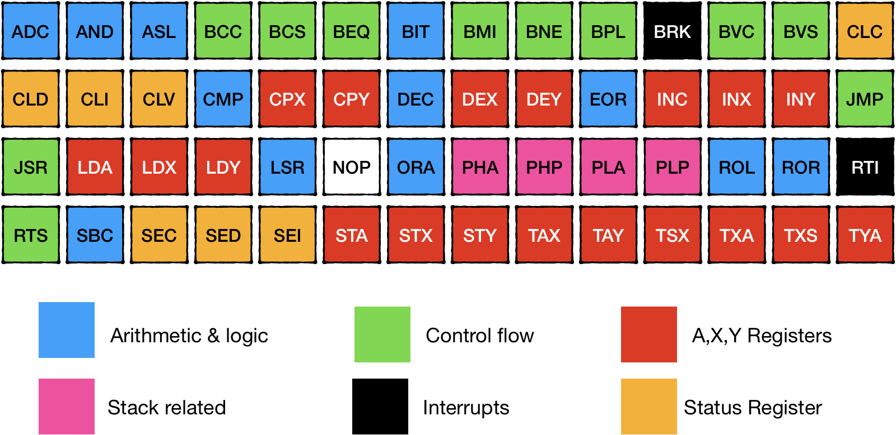

本章的目标是让我们的第一个 NES 游戏启动并运行。接下来我们要玩的是贪吃蛇游戏。
你可以在[这个片段](https://gist.github.com/wkjagt/9043907)中找到带有注释的源代码。

在任何计算机系统中，CPU都是核心部分。
CPU 的任务是 运行程序指令 并 协调所有可用的硬件模块 以提供完整的游戏体验。
尽管 PPU 和 APU 工作在各自独立的电路中，但是他们仍然受 CPU 时钟的影响，并执行 CPU 发出的指令。

在开始实现之前，我们需要简要讨论一下 CPU 可以使用哪些资源来完成其工作。

## 寻址模式

CPU 可以访问的仅有的两个资源，分别是 内存映射 和 CPU 寄存器。

从编程的角度来看，内存映射只是一个以1字节为单元的连续数组。
NES CPU 使用 16-bit 进行内存寻址，这意味着它可以寻址 65536 个不同的内存单元。

正如我们之前所见，NES 平台只有 2 KiB 的 RAM 连接到 CPU。

该 RAM 可通过 **[0x0000 ... 0x2000]** 地址空间访问。

对 **[0x2000 ... 0x4020]** 的访问被重定向到其他可用的 NES 硬件模块：PPU、APU、GamePad 等（稍后会详细介绍）。

而 **[0x4020 ... 0x6000]** 是一个特殊的空间，不同的卡带使用方式不同。
它们可能被映射到 RAM、ROM 或者什么都没有。该空间由 Mapper 控制。我们将暂时忽略这个空间。

如果卡带上面有有自带的 RAM 空间，则对 **[0x6000 ... 0x8000]** 的访问则保留给卡带上的 RAM 空间。
它在 Zelda 等游戏中用于存储和检索游戏状态。我们也暂时将忽略这部分空间。

对 **[0x8000 ... 0x10000]** 的访问被映射到卡带上的 Program ROM (PRG ROM) 空间。

对于 CPU 内存映射的详细信息，可以查看：<https://www.nesdev.org/wiki/CPU_memory_map>

内存访问相对较慢，NES CPU 有一些称为寄存器的内部内存插槽，访问延迟显着降低。

> | CPU 操作类型  | 执行时间（以 CPU 周期为单位） |
> |---|---|
> | 仅访问寄存器                         | 2        |
> | 访问 RAM 的前 255 个字节             | 3        |
> | 访问 RAM 255个字节之后的空间          | 4-7      |

NES CPU 有 7 个寄存器：

* Program Counter (*PC*) -
  保存下一条要执行的机器语言指令的地址

* Stack Pointer -
  内存空间 **[0x0100 ... 0x1FF]** 用于堆栈。
  堆栈指针保存该空间顶部的地址。 NES 堆栈（与所有堆栈一样）从上到下增长：当一个字节被压入堆栈时，SP 寄存器递减。当从堆栈中检索一个字节时，SP 寄存器递增。

* Accumulator (*A*) -
  存储算术、逻辑和内存访问操作的结果。它用作某些操作的输入参数。

* Index Register X (*X*) -
  用作特定内存寻址模式中的偏移量（稍后会详细介绍）。
  可用于辅助存储需求（保存临时值、用作计数器等）。

* Index Register Y (*Y*) - 作用与寄存器 X 类似。

* Processor status (*P*) -
  8 位寄存器表示 7 个状态标志，可以根据最后执行指令的结果设置或取消设置。
  例如，如果操作的结果为 0，则设置 Z 标志 (1)，否则取消设置 Z 标志。

## 指令集

每个 CPU 都带有一个预定义的指令集，该指令集定义了 CPU 可以执行的所有操作。

CPU 以机器码的形式从应用层接收指令。您可以将机器语言视为连接软件和硬件的薄层。

官方 6502 指令的完整列表：

* <https://www.masswerk.at/6502/6502_instruction_set.html>
* <http://www.6502.org/tutorials/6502opcodes.html>

我倾向于使用这两个链接。这些页面提供了可用 CPU 功能及其机器代码的完整规格表。

我强烈建议在继续之前阅读这个[关于 6502 指令的交互式教程](https://skilldrick.github.io/easy6502/)。

6502芯片是比较简单的CPU；它仅支持六种类型的命令和大约 64 个独特的命令。
因为有些指令对于不同的内存寻址模式有多个版本，这导致我们要实现大约 150 个机器代码操作。

> **提示:** NES 使用一个基于 6502 的定制芯片 2A03，它与原版芯片有明显的区别：
>
> * 除了官方机器操作，它还有大约 110 个非官方的附加操作码（幸运的是，其中大约三分之一是 No-OPs）
> * 它板载音频处理单元
> * 它不支持算术的十进制模式
>
> 为了简单起见，我们需要实现对 256 种不同机器指令的支持。
>
> 好消息是指令之间有很多相似之处。一旦我们有了基础，我们将不断地重用它们来实现整个系列。
