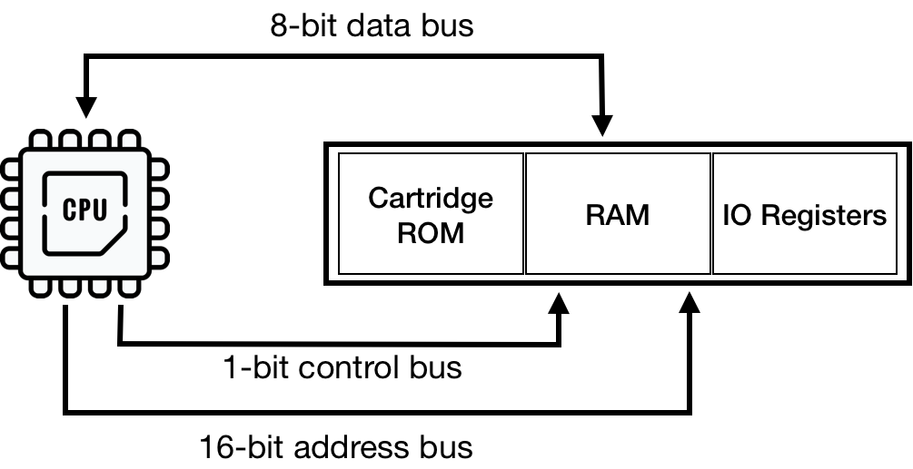
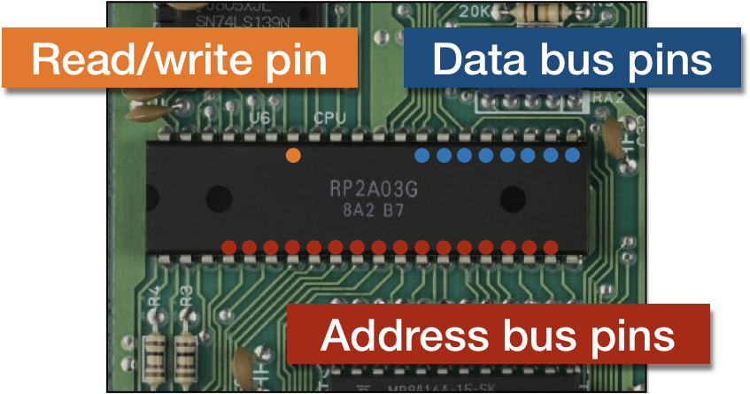
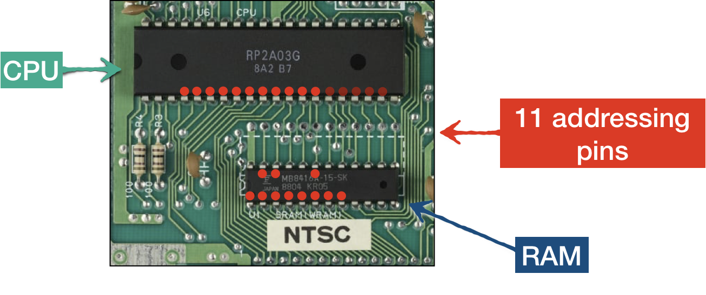

CPU 使用三种总线访问内存（包括内存映射空间）：

* 地址总线承载所需位置的地址
* 控制总线负责通知访问是读还是写
* 数据总线承载正在读取或写入的数据字节

总线本身不是一种设备，它是平台组件之间的连线。所以我们不需要将它实现为一个独立的模块，因为 Rust 允许我们直接“连接”组件。
但是，对总线进行抽象可以让我们将很多 CPU 中的逻辑转移到 总线 中，以此来保持 CPU 代码的简洁。



在我们当前的代码中，CPU 可以直接访问 RAM 空间，并且忽略了内存映射区域。

通过引入 Bus 模块，我们可以有一个专门的地方用于：

* 内部设备通讯
  * 数据读写
  * 将硬件中断路由到 CPU（稍后会详细介绍） （Routing hardware interrupts to CPU）
* 处理内存映射
* 协调 PPU 和 CPU 时钟周期（稍后会详细介绍）

我们不需要编写数据、控制和地址总线的全面仿真。
因为它不是一个硬件芯片，任何逻辑都不期望总线有任何特定的行为。
所以我们可以只编写协调和信号路由

目前，我们可以实现 BUS 的基本功能：

* 访问 CPU RAM
* 镜像

镜像是 NES 试图让东西尽可能便宜的副作用。
它可以看作是一个地址空间被映射到另一个地址空间。

例如，在 CPU 内存映射 RAM 地址空间 **[0x000 .. 0x0800]** (2 KiB) 被镜像 3 次：

* **[0x800 .. 0x1000]**
* **[0x1000 .. 0x1800]**
* **[0x1800 .. 0x2000]**

这意味着在读取或写入时访问 **0x0000**、**0x0800**、**0x1000** 或 **0x1800** 的内存地址没有区别。

镜像的原因是 CPU RAM 只有 2 KiB 的 ram 空间，只用 11 位就足以寻址 RAM 空间。
自然地，NES 主板只有 11 个从 CPU 到 RAM 的寻址轨道。



然而，CPU 有 **[0x0000 - 0x2000]** 为 RAM 空间保留的寻址空间 - 那是 13 位。
因此，在访问 RAM 时，最高 2 位无效。
换句话说，当 CPU 请求 `0b0001_1111_1111_1111`（13 位）地址时，RAM 芯片将通过地址总线仅接收 `0b111_1111_1111`（11 位）。

因此，尽管镜像看起来很浪费，但它是布线的副作用，在真实硬件上它没有任何成本。
另一方面，模拟器必须做额外的工作才能提供相同的行为。

长话短说，如果 BUS 收到 **[0x0000 ... 0x2000]** 范围内的请求，则需要将最高 2 位清零。

类似地，地址空间 **[0x2008 .. 0x4000]** 反映了 PPU 寄存器 **[0x2000 .. 0x2008]** 的内存映射。
这些是 BUS 将负责的仅有的两个镜像。让我们立即对其进行编码，即使我们还没有 PPU 相关的任何东西。

所以让我们介绍一个新的模块 Bus，它可以直接访问 RAM。

```rust
pub struct Bus {
  cpu_vram: [u8; 2048]
}

impl Bus {
  pub fn new() -> Self{
    Bus {
      cpu_vram: [0; 2048]
    }
  }
}
```

总线还将提供读/写访问：

```rust
const RAM: u16 = 0x0000;
const RAM_MIRRORS_END: u16 = 0x1FFF;
const PPU_REGISTERS: u16 = 0x2000;
const PPU_REGISTERS_MIRRORS_END: u16 = 0x3FFF;

impl Mem for Bus {
  fn mem_read(&self, addr: u16) -> u8 {
    match addr {
      RAM ..= RAM_MIRRORS_END => {
        let mirror_down_addr = addr & 0b00000111_11111111;
        self.cpu_vram[mirror_down_addr as usize]
      }
      PPU_REGISTERS ..= PPU_REGISTERS_MIRRORS_END => {
        let _mirror_down_addr = addr & 0b00100000_00000111;
        todo!("PPU is not supported yet")
      }
      _ => {
        println!("Ignoring mem access at {}", addr);
        0
      }
    }
  }

  fn mem_write(&mut self, addr: u16, data: u8) {
    match addr {
      RAM ..= RAM_MIRRORS_END => {
        let mirror_down_addr = addr & 0b11111111111;
        self.cpu_vram[mirror_down_addr as usize] = data;
      }
      PPU_REGISTERS ..= PPU_REGISTERS_MIRRORS_END => {
        let _mirror_down_addr = addr & 0b00100000_00000111;
        todo!("PPU is not supported yet");
      }
      _ => {
        println!("Ignoring mem write-access at {}", addr);
      }
    }
  }
}
```

最后一步是将 CPU 对 RAM 的直接访问替换为通过 BUS 访问

```rust
pub struct CPU {
  pub register_a: u8,
  pub register_x: u8,
  pub register_y: u8,
  pub status: CpuFlags,
  pub program_counter: u16,
  pub stack_pointer: u8,
  pub bus: Bus,
}


impl Mem for CPU {
  fn mem_read(&self, addr: u16) -> u8 {
    self.bus.mem_read(addr)
  }

  fn mem_write(&mut self, addr: u16, data: u8) {
    self.bus.mem_write(addr, data)
  }
  fn mem_read_u16(&self, pos: u16) -> u16 {
    self.bus.mem_read_u16(pos)
  }

  fn mem_write_u16(&mut self, pos: u16, data: u16) {
    self.bus.mem_write_u16(pos, data)
  }
}

impl CPU {
  pub fn new() -> Self {
    CPU {
      register_a: 0,
      register_x: 0,
      register_y: 0,
      stack_pointer: STACK_RESET,
      program_counter: 0,
      status: CpuFlags::from_bits_truncate(0b100100),
      bus: Bus::new(),
    }
  }
  // ...
}
```

现在就差不多了。不难，对吧？

------

> 本章节代码： [GitHub](https://github.com/bugzmanov/nes_ebook/tree/master/code/ch4)
