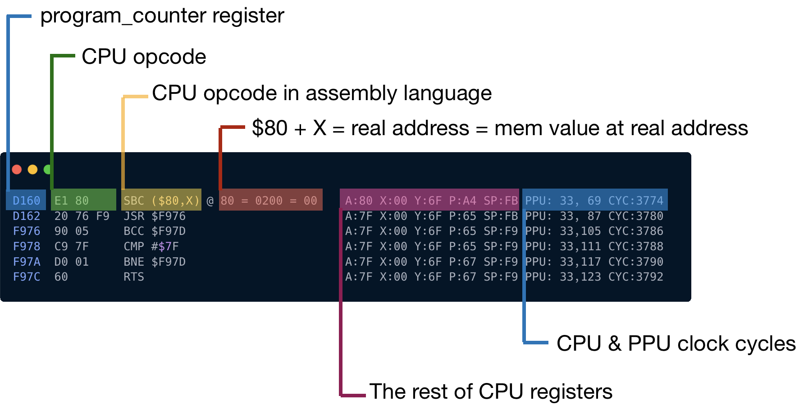

NES 开发社区已经创建了[大量的测试套件](https://wiki.nesdev.com/w/index.php/Emulator_tests)，可用于检查我们的模拟器。

它们几乎涵盖了模拟器的各个方面，包括平台中奇怪的和值得注意的错误。


我们将从主要涵盖 CPU 功能的最基本测试开始：指令集、内存访问和 CPU 周期。

测试的 iNES 文件位于此处：[nestest.nes](http://nickmass.com/images/nestest.nes) ，
测试附带执行日志，日志文件位于 [nestest.log](https://www.qmtpro.com/~nes/misc/nestest.log)。

我们的下一个目标是在运行程序时为 CPU 生成类似的执行日志。



目前而言，我们可以忽略最后一列而专注于前五列。

第四列 `@ 80 = 0200 = 00` 有点意思。

* 如果我们对请求地址应用偏移量，那么第一个数字是我们得到的实际内存引用。
  `0xE1` 使用 Indirect X 寻址方式，偏移量由寄存器 X 定义
* 第二个数字是从 **[0x80 .. 0x81]** 获取的 2 字节目标地址。在上面的例子中是 `[0x00, 0x02]`
* 第三个数字是地址 `0x0200` 的值

我们已经有了对 CPU 执行拦截的方法：

```rust
impl CPU  {

  // ..
  pub fn run_with_callback<F>(&mut self, mut callback: F) where F: FnMut(&mut CPU), {
    let ref opcodes: HashMap<u8, &'static opcodes::OpCode> = *opcodes::OPCODES_MAP;

    loop {
      callback(self);
      // ...
    }
  }
}
```

我们需要做的就是创建一个回调函数来跟踪 CPU 状态：

```rust
fn main() {
  //...
  cpu.run_with_callback(move |cpu| {
    println!("{}", trace(cpu));
  }
}
```

生成与提供的日志模版格式完全相同的日志至关重要。

以下测试可能有所帮助帮助：

```rust
#[cfg(test)]
mod test {
  use super::*;
  use crate::bus::Bus;
  use crate::cartridge::test::test_rom;

  #[test]
  fn test_format_trace() {
      let mut bus = Bus::new(test_rom());
      bus.mem_write(100, 0xa2);
      bus.mem_write(101, 0x01);
      bus.mem_write(102, 0xca);
      bus.mem_write(103, 0x88);
      bus.mem_write(104, 0x00);

      let mut cpu = CPU::new(bus);
      cpu.program_counter = 0x64;
      cpu.register_a = 1;
      cpu.register_x = 2;
      cpu.register_y = 3;
      let mut result: Vec<String> = vec![];
      cpu.run_with_callback(|cpu| {
          result.push(trace(cpu));
      });
      assert_eq!(
          "0064  A2 01     LDX #$01                        A:01 X:02 Y:03 P:24 SP:FD",
          result[0]
      );
      assert_eq!(
          "0066  CA        DEX                             A:01 X:01 Y:03 P:24 SP:FD",
          result[1]
      );
      assert_eq!(
          "0067  88        DEY                             A:01 X:00 Y:03 P:26 SP:FD",
          result[2]
      );
  }

  #[test]
  fn test_format_mem_access() {
      let mut bus = Bus::new(test_rom());
      // ORA ($33), Y
      bus.mem_write(100, 0x11);
      bus.mem_write(101, 0x33);


      //data
      bus.mem_write(0x33, 00);
      bus.mem_write(0x34, 04);

      //target cell
      bus.mem_write(0x400, 0xAA);

      let mut cpu = CPU::new(bus);
      cpu.program_counter = 0x64;
      cpu.register_y = 0;
      let mut result: Vec<String> = vec![];
      cpu.run_with_callback(|cpu| {
          result.push(trace(cpu));
      });
      assert_eq!(
          "0064  11 33     ORA ($33),Y = 0400 @ 0400 = AA  A:00 X:00 Y:00 P:24 SP:FD",
          result[0]
      );
  }
}
```

现在是时候将我们的执行日志与黄金标准进行比较了。

```bash
cargo run > mynes.log
diff -y mynes.log nestest.log
```

> 你可以使用任何你喜欢的差异工具。
> 但是因为我们的 NES 还不支持 CPU 时钟周期，所以删除提供的日志中的最后一列是有意义的：
>
> ```bash
> cat nestest.log | awk '{print substr($0,0, 73)}' > nestest_no_cycle.log
> diff -y mynes.log nestest_no_cycle.log
> ```

如果一切正常，第一个不匹配应该如下所示：

```txt
C6B3  A9 AA     LDA #$AA                        A:FF X:97 Y:4   C6B3  A9 AA     LDA #$AA                        A:FF X:97 Y:4
C6B5  D0 05     BNE $C6BC                       A:AA X:97 Y:4   C6B5  D0 05     BNE $C6BC                       A:AA X:97 Y:4
C6BC  28        PLP                             A:AA X:97 Y:4   C6BC  28        PLP                             A:AA X:97 Y:4
                                                              > C6BD  04 A9    *NOP $A9 = 00                    A:AA X:97 Y:4
```

即，我们的模拟器生成的所有内容都应该完全符合黄金标准，直到 `0xC6BC` 行。

如果在此行之前有任何不匹配，说明我们的 CPU 实现存在错误，需要修复。

但这并不能解释为什么我们的程序会被终止。为什么我们在 `0xC6BC` 行之后没有得到完美匹配？

程序失败的地方是：

```txt
C6BD  04 A9    *NOP $A9 = 00
```

看起来我们的 CPU 不知道如何解释操作码 0x04。

坏消息是：大约有 110 条非官方 CPU 指令。
大多数真正的NES游戏都大量使用它们。为了让我们继续前进，我们需要实现所有这些缺少的指令。

可以在这里找到相关说明：

* [nesdev.com/undocumented_opcodes.txt](http://nesdev.com/undocumented_opcodes.txt)
* [wiki.nesdev.com/w/index.php/Programming_with_unofficial_opcodes](https://wiki.nesdev.com/w/index.php/Programming_with_unofficial_opcodes)
* [wiki.nesdev.com/w/index.php/CPU_unofficial_opcodes](https://wiki.nesdev.com/w/index.php/CPU_unofficial_opcodes)
* [www.oxyron.de/html/opcodes02.html](http://www.oxyron.de/html/opcodes02.html)

还记得如何画猫头鹰吗？

测试 ROM 应该会推动您的进步。最后，CPU 应该支持 256 条指令。考虑到 1 个字节用于操作码，我们已经实现了所有可能的值。

最后，第一个不匹配应该发生在这一行：

```bash
C68B  8D 15 40  STA $4015 = FF                  A:02 X:FF Y:15 P:25 SP:FB
```

几乎在 NES 测试日志文件的最后。

这是一个好兆头。 因为 `4015` 是 APU 寄存器的内存映射，我们还没有实现。

------

> 本章代码: [GitHub](https://github.com/bugzmanov/nes_ebook/tree/master/code/ch5.1)
