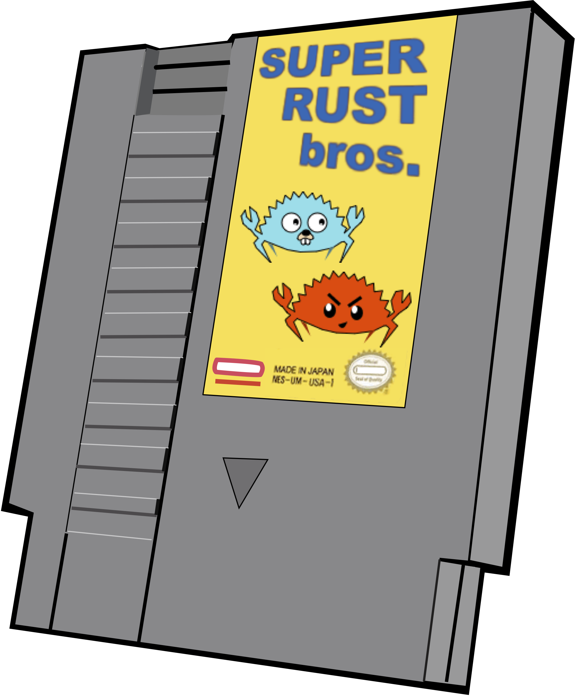
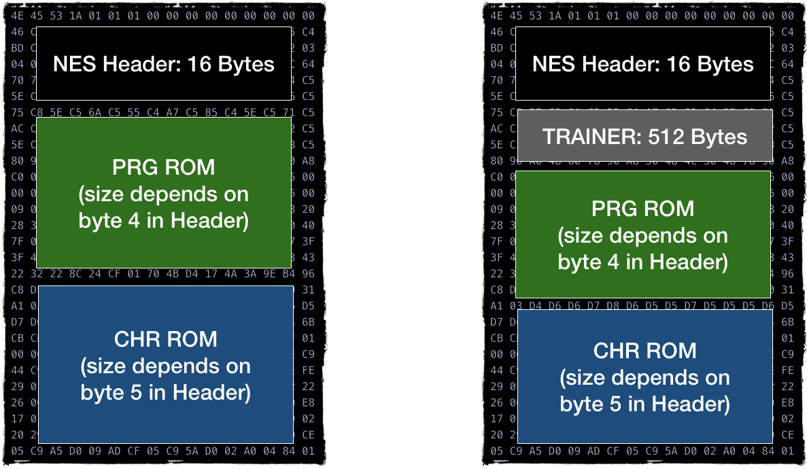
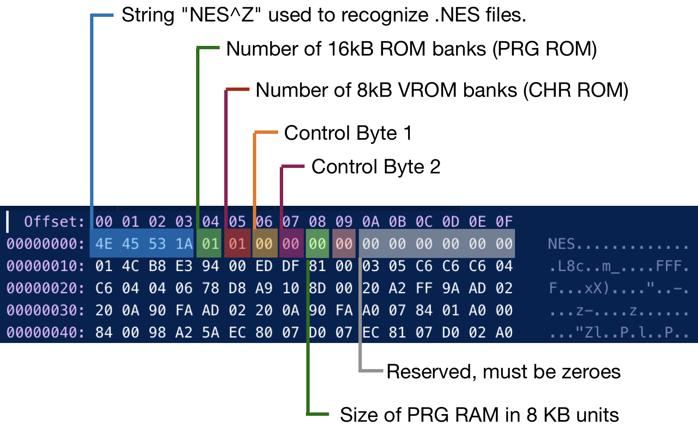

第一版的卡带相对简单。它们带有两组 ROM 存储器：用于代码的 PRG ROM 和用于可视图形的 CHR ROM。

插入控制台后，PRG ROM 连接到 CPU，CHR ROM 连接到 PPU。
所以在硬件层面，CPU 无法直接访问 CHR ROM，PPU 也无法访问 PRG ROM。

> 更高版本的卡带具有额外的硬件：
>
> * Mapper 提供对扩展 ROM 存储器的访问：CHR ROM 和 PRG ROM
> * 额外带电池的 RAM 来保存和恢复游戏状态

但是，我们不会模拟卡带。因为模拟器使用游戏 ROM 的转储 dump 文件。

ROM 转储有多种文件格式；最受欢迎的是由 [Marat Fayzullin](http://fms.komkon.org) 设计的 iNES 格式



该文件格式包含 3-4 个部分：

* 16-byte 文件头部描述信息
* 可选 512 字节的 Trainer
* 包含 PRG ROM 代码的部分
* 包含 CHR ROM 数据的部分

其中 Header 是最有趣的部分。



控制字节 1 和控制字节 2（Header 中的字节 06 和 07）包含有关文件中数据的一些附加信息，但它是按位打包的。

|   |   |
|---|---|
|  |  |

我们不会涵盖和支持 iNES 2.0 格式，因为它不是很流行。但是您可以找到[两个 iNES 版本的正式规范](https://formats.kaitai.io/ines/index.html)。

我们关心的最基本信息：

* PRG ROM
* CHR ROM
* Mapper 类型
* 镜像类型: Horizontal, Vertical, 4 Screen

镜像将在后面的 PPU 章节中详细介绍。现在，我们只需要弄清楚游戏使用的是哪种镜像类型。

我们将仅支持 iNES 1.0 文件格式和 Mapper 0.

映射器 0 本质上意味着 CPU 按原样读取 CHR 和 PRG ROM，即无需映射。

接下来让我们来定义卡带的数据模型：

```rust
#[derive(Debug, PartialEq)]
pub enum Mirroring {
  VERTICAL,
  HORIZONTAL,
  FOUR_SCREEN,
}

pub struct Rom {
  pub prg_rom: Vec<u8>,
  pub chr_rom: Vec<u8>,
  pub mapper: u8,
  pub screen_mirroring: Mirroring,
}

```

然后我们需要编写解析二进制文件的代码：

```rust
impl Rom {
  pub fn new(raw: &Vec<u8>) -> Result<Rom, String> {
    if &raw[0..4] != NES_TAG {
      return Err("File is not in iNES file format".to_string());
    }

    let mapper = (raw[7] & 0b1111_0000) | (raw[6] >> 4);

    let ines_ver = (raw[7] >> 2) & 0b11;
    if ines_ver != 0 {
      return Err("NES2.0 format is not supported".to_string());
    }

    let four_screen = raw[6] & 0b1000 != 0;
    let vertical_mirroring = raw[6] & 0b1 != 0;
    let screen_mirroring = match (four_screen, vertical_mirroring) {
      (true, _) => Mirroring::FOUR_SCREEN,
      (false, true) => Mirroring::VERTICAL,
      (false, false) => Mirroring::HORIZONTAL,
    };

    let prg_rom_size = raw[4] as usize * PRG_ROM_PAGE_SIZE;
    let chr_rom_size = raw[5] as usize * CHR_ROM_PAGE_SIZE;

    let skip_trainer = raw[6] & 0b100 != 0;

    let prg_rom_start = 16 + if skip_trainer { 512 } else { 0 };
    let chr_rom_start = prg_rom_start + prg_rom_size;

    Ok(Rom {
      prg_rom: raw[prg_rom_start..(prg_rom_start + prg_rom_size)].to_vec(),
      chr_rom: raw[chr_rom_start..(chr_rom_start + chr_rom_size)].to_vec(),
      mapper: mapper,
      screen_mirroring: screen_mirroring,
    })
  }
}

```

一如既往，别忘了测试！

然后继续，将 ROM 和 Bus 连接到一起：

```rust
pub struct Bus {
  cpu_vram: [u8; 2048],
  rom: Rom,
}

impl Bus {
  pub fn new(rom: Rom) -> Self {
    Bus {
      cpu_vram: [0; 2048],
      rom: rom,
    }
  }
  //....
}
```

最后，我们需要映射地址空间 **[0x8000 … 0x10000]** 到 PRG ROM。

一个需要注意的地方时：PRG DOM 大小可能是 16 KiB 或 32 KiB。
因为 **[0x8000 … 0x10000]** 映射区域是 32 KiB 的可寻址空间，
所以需要将高 16 KiB 映射到低 16 KiB（如果游戏只有 16 KiB 的 PRG ROM）

```rust
impl Mem for Bus {
  fn mem_read(&self, addr: u16) -> u8 {
    match addr {
      //….
      0x8000..=0xFFFF => self.read_prg_rom(addr),
    }
  }

  fn mem_write(&mut self, addr: u16, data: u8) {
    match addr {
      //...
      0x8000..=0xFFFF => {
        panic!("Attempt to write to Cartridge ROM space")
      }
    }
  }
}

impl Bus {
  // ...

  fn read_prg_rom(&self, mut addr: u16) -> u8 {
    addr -= 0x8000;
    if self.rom.prg_rom.len() == 0x4000 && addr >= 0x4000 {
      //mirror if needed
      addr = addr % 0x4000;
    }
    self.rom.prg_rom[addr as usize]
  }
}
```

你可以在 [Github](https://github.com/bugzmanov/nes_ebook/blob/master/code/ch5/snake.nes?raw=true) 上下载你的第一个 NES ROM 文件。

你需要修改`main`方法以从文件加载二进制代码。

剧透警报：这是修改版的贪吃蛇游戏，具有更有趣的物理特性。游戏要求输入设备、屏幕输出和随机数生成器使用相同的内存映射。

------

> 本章代码: [GitHub](https://github.com/bugzmanov/nes_ebook/tree/master/code/ch5)
