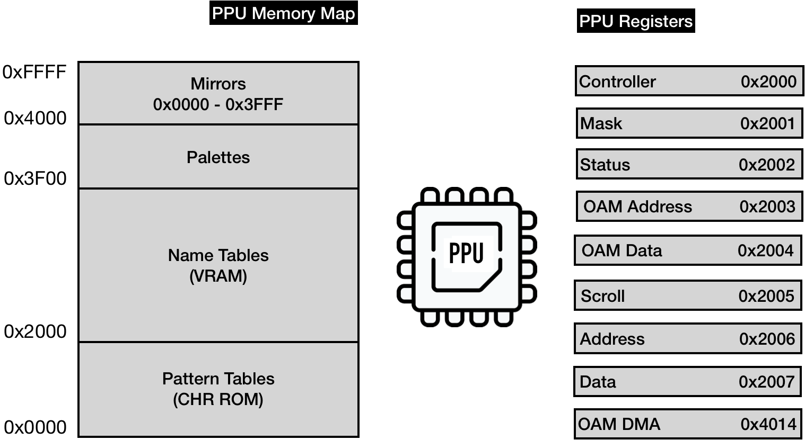
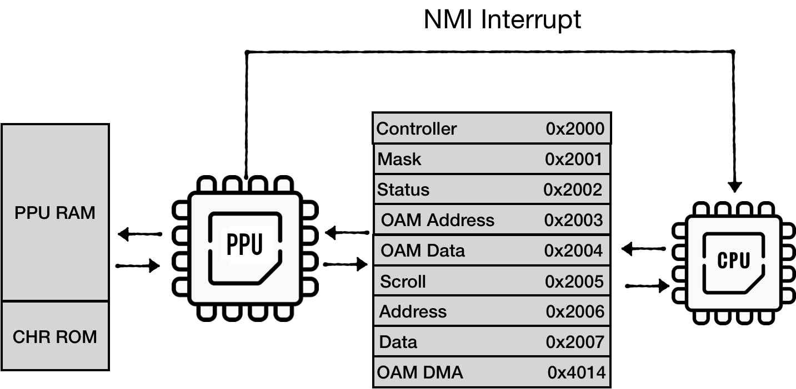
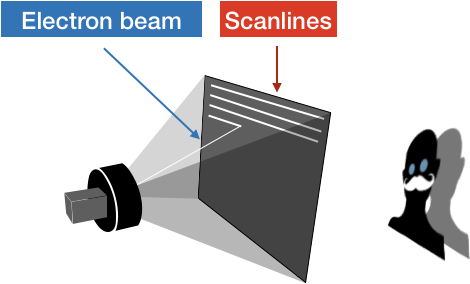
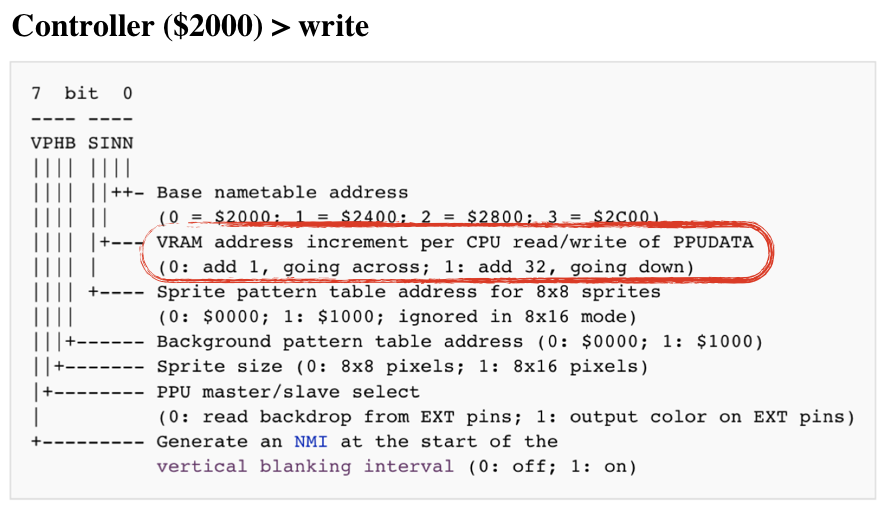
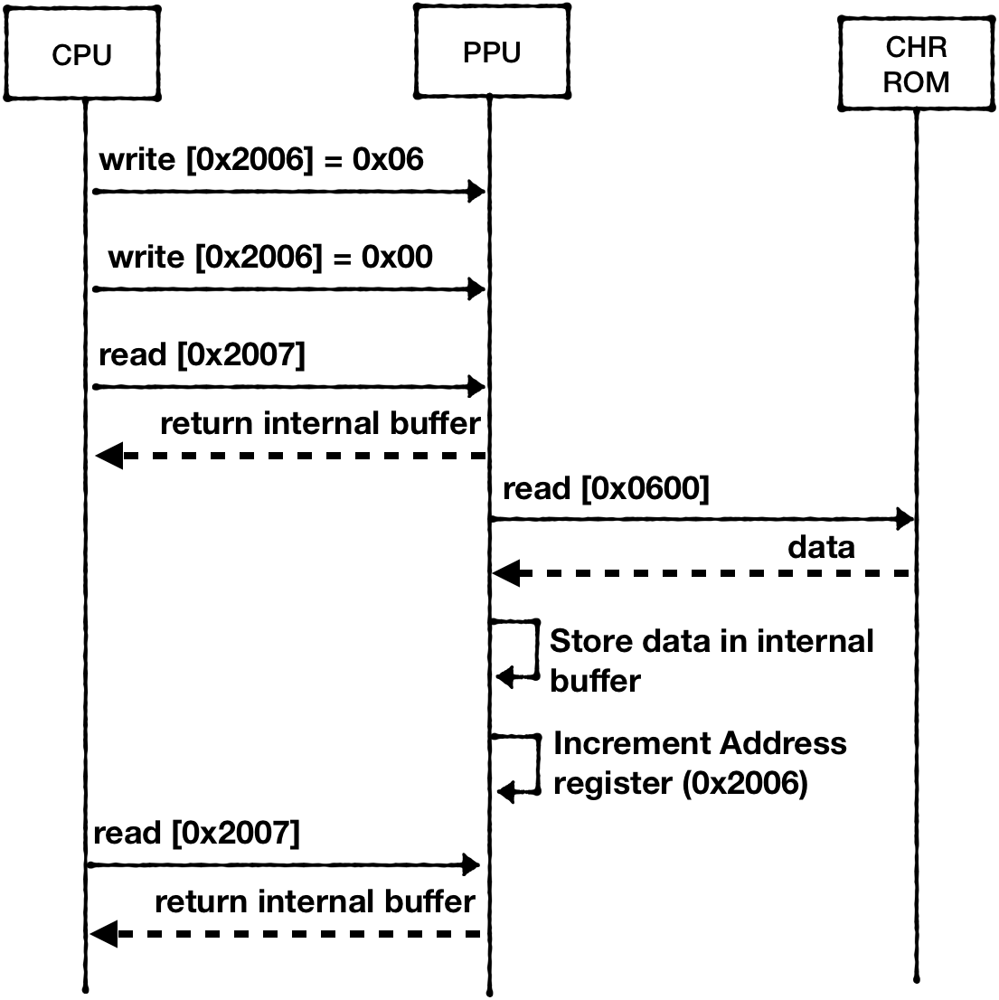
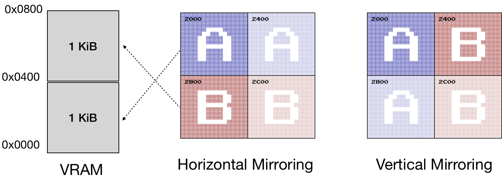

PPU有自己的内存映射，由PPU RAM、CHR ROM、地址空间镜像组成。
PPU 公开了 8 个 I/O 寄存器，供 CPU 用于通信。
这些寄存器映射到 CPU 内存映射中的 **[0x2000..0x2007]**（并通过 **[0x2008..0x3FFF]** 区域每 8 个字节镜像一次）



准确地说，PPU 有自己的总线用于与 RAM 和卡带的 CHR ROM 通信。但我们不一定需要完全模仿总线。

2个寄存器负责访问PPU内存映射：

* 地址 (0x2006) 和数据 (0x2007) - 提供对可用于 PPU 的内存映射的访问

3个寄存器控制内部存储器（OAM），以保持精灵（Sprites）的状态

* OAM 地址 (0x2003) 和 OAM 数据 (0x2004) - 对象属性内存（Object Attribute Memory） - 负责精灵（Sprites）的空间
* 直接内存访问 (0x4014) - 用于将 256 字节从 CPU RAM 快速复制到 OAM

3 只写（Write-only）寄存器控制 PPU 动作：

* Controller (0x2000) - 向 PPU 指示一般逻辑流程（使用哪个内存表，PPU 是否应该中断 CPU 等）
* Mask (0x2001) - 指示 PPU 如何渲染 Sprites 精灵和背景
* Scroll (0x2005) - 指示 PPU 如何设置视口

一个只读寄存器用于报告 PPU 状态：

* Status 0x2002

寄存器的完整规范可以在 [NES Dev wiki](http://wiki.nesdev.com/w/index.php/PPU_registers) 上找到。



CPU 和 PPU 之间存在两个通信通道：

* CPU 通过 IO 寄存器通信
* PPU 进入 V-BLANK 周期后向 CPU 发送中断信号

> PPU 执行生命周期与电视屏幕的电子束紧密耦合。
>
> PPU 每帧渲染 262 条扫描线。 （0 - 240 为可见扫描线，其余为所谓的垂直过扫描）
>
> 每条扫描线持续 341 个 PPU 时钟周期，每个时钟周期产生一个像素。 （前 256 个像素可见，其余为水平过扫描）
>
> NES 屏幕分辨率为 320x240，因此扫描线 241 - 262 不可见。
>
> 
>
> 进入第241条扫描线后，PPU触发CPU上的 VBlank NMI。
> PPU在241-262扫描线期间不进行内存访问，因此程序可以自由访问PPU内存。
> 大多数游戏都很安全，只在这段时间内更新屏幕状态，基本上是为下一帧准备视图状态。

## PPU草图

PPU 的初始草图如下所示：

```rust
pub struct NesPPU {
  pub chr_rom: Vec<u8>,
  pub palette_table: [u8; 32],
  pub vram: [u8; 2048],
  pub oam_data: [u8; 256],

  pub mirroring: Mirroring,
}
```

* **chr_rom** - 存储在卡带上的游戏的视觉数据
* **palette_table** - 用于保存屏幕使用的调色板表的内部存储器
* **vram** - 2 KiB 存储空间用于保存背景信息
* **oam_data** - 保持精灵状态的内部存储器

Mirroring 和 chr_rom 特定于每个游戏，由卡带提供

```rust
impl NesPPU {
  pub fn new(chr_rom: Vec<u8>, mirroring: Mirroring) -> Self {
    NesPPU {
      chr_rom: chr_rom,
      mirroring: mirroring,
      vram: [0; 2048],
      oam_data: [0; 64 * 4],
      palette_table: [0; 32],
    }
  }
}
```

## 模拟 PPU 内存访问：地址和数据寄存器

让我们尝试模拟两个最复杂的寄存器：地址（0x2006）和数据（0x2007）

CPU 访问 PPU RAM 的方式有多个注意事项。
假设 CPU 想要访问位于 0x0600 PPU 内存空间的内存单元：

1) 它必须将请求地址加载到 Addr 寄存器中。
   它必须两次写入寄存器 - 将 2 个字节加载到 1 个字节的寄存器中：

    ```bash
    LDA #$06
    STA $2006
    LDA #$00
    STA $2006
    ```

    注意：它不遵循 little-endian 表示法

2) 然后，CPU 可以请求从 PPU 数据寄存器 (0x2007) 加载数据

    ```bash
    LDA $2007
    ```

    > 因为 CHR ROM 和 RAM 被认为是 PPU 的外部设备，所以 PPU 不能立即返回值。
    > PPU 必须获取数据并将其保存在内部缓冲区中。
    >
    > 从 0x2007 开始的第一次读取将返回在上一次加载操作期间填充的内部缓冲区的内容。从 CPU 的角度来看，这是一个虚拟读取。

3) CPU 必须再从 0x2007 读取一次，才能最终从 PPU 内部缓冲区中获取值。

    ```bash
    LDA $2007
    ```

> 另请注意，对 0x2007 的读取或写入访问会增加 PPU 地址 (0x2006)。
> 增量大小由控制寄存器 (0x2000) 的状态决定：
>
> 

下图可以说明请求的顺序：



> 重要提示：这种缓冲读取行为仅特定于 ROM 和 RAM。
>
> 从 $3F00-$3FFF 读取调色板数据的工作方式不同。
> 调色板数据立即放在数据总线上，因此不需要虚拟读取。

让我们先创建 地址寄存器 的模型：

```rust
pub struct AddrRegister {
  value: (u8, u8),
  hi_ptr: bool,
}

impl AddrRegister {
  pub fn new() -> Self {
    AddrRegister {
      value: (0, 0), // high byte first, lo byte second
      hi_ptr: true,
    }
  }
  fn set(&mut self, data: u16) {
    self.value.0 = (data >> 8) as u8;
    self.value.1 = (data & 0xff) as u8;
  }

  pub fn update(&mut self, data: u8) {
    if self.hi_ptr {
      self.value.0 = data;
    } else {
      self.value.1 = data;
    }

    if self.get() > 0x3fff { //mirror down addr above 0x3fff
      self.set(self.get() & 0b11111111111111);
    }
    self.hi_ptr = !self.hi_ptr;
  }

  pub fn increment(&mut self, inc: u8) {
    let lo = self.value.1;
    self.value.1 = self.value.1.wrapping_add(inc);
    if lo > self.value.1 {
      self.value.0 = self.value.0.wrapping_add(1);
    }
    if self.get() > 0x3fff {
      self.set(self.get() & 0b11111111111111); //mirror down addr above 0x3fff
    }
  }

  pub fn reset_latch(&mut self) {
    self.hi_ptr = true;
  }

  pub fn get(&self) -> u16 {
    ((self.value.0 as u16) << 8) | (self.value.1 as u16)
  }
}
```

接下来，我们需要将此寄存器公开为可写：

```rust
pub struct NesPPU {
  //...
  addr: AddrRegister,
}

impl NesPPU {
  // ...
  fn write_to_ppu_addr(&mut self, value: u8) {
    self.addr.update(value);
  }
}
```

接下来，我们可以勾勒出控制器寄存器：

```rust
bitflags! {

  // 7  bit  0
  // ---- ----
  // VPHB SINN
  // |||| ||||
  // |||| ||++- Base nametable address
  // |||| ||    (0 = $2000; 1 = $2400; 2 = $2800; 3 = $2C00)
  // |||| |+--- VRAM address increment per CPU read/write of PPUDATA
  // |||| |     (0: add 1, going across; 1: add 32, going down)
  // |||| +---- Sprite pattern table address for 8x8 sprites
  // ||||       (0: $0000; 1: $1000; ignored in 8x16 mode)
  // |||+------ Background pattern table address (0: $0000; 1: $1000)
  // ||+------- Sprite size (0: 8x8 pixels; 1: 8x16 pixels)
  // |+-------- PPU master/slave select
  // |          (0: read backdrop from EXT pins; 1: output color on EXT pins)
  // +--------- Generate an NMI at the start of the
  //            vertical blanking interval (0: off; 1: on)
  pub struct ControlRegister: u8 {
    const NAMETABLE1              = 0b00000001;
    const NAMETABLE2              = 0b00000010;
    const VRAM_ADD_INCREMENT      = 0b00000100;
    const SPRITE_PATTERN_ADDR     = 0b00001000;
    const BACKROUND_PATTERN_ADDR  = 0b00010000;
    const SPRITE_SIZE             = 0b00100000;
    const MASTER_SLAVE_SELECT     = 0b01000000;
    const GENERATE_NMI            = 0b10000000;
  }
}

impl ControlRegister {
  pub fn new() -> Self {
    ControlRegister::from_bits_truncate(0b00000000)
  }

  pub fn vram_addr_increment(&self) -> u8 {
    if !self.contains(ControlRegister::VRAM_ADD_INCREMENT) {
      1
    } else {
      32
    }
  }

  pub fn update(&mut self, data: u8) {
    self.bits = data;
  }
}
```

并将其公开为可写：

```rust
pub struct NesPPU {
  pub ctrl: ControlRegister,
  //...
}

impl NesPPU {
  //...
  fn write_to_ctrl(&mut self, value: u8) {
    self.ctrl.update(value);
  }
}
```

现在我们可以尝试实现读取PPU内存：

```rust
impl NesPPU {
  //...
  fn increment_vram_addr(&mut self) {
    self.addr.increment(self.ctrl.vram_addr_increment());
  }


  fn read_data(&mut self) -> u8 {
    let addr = self.addr.get();
    self.increment_vram_addr();

    match addr {
      0..=0x1fff => todo!("read from chr_rom"),
      0x2000..=0x2fff => todo!("read from RAM"),
      0x3000..=0x3eff => panic!("addr space 0x3000..0x3eff is not expected to be used, requested = {} ", addr),
      0x3f00..=0x3fff => {
        self.palette_table[(addr - 0x3f00) as usize]
      }
      _ => panic!("unexpected access to mirrored space {}", addr),
    }
  }
}
```

我们可以通过使用临时字段来保存来自先前读取请求的值来模拟 RAM 和 ROM 的这种内部缓冲区行为：

```rust
pub struct NesPPU {
  //..
  internal_data_buf: u8,
}

impl NesPPU {
  // ...

  fn read_data(&mut self) -> u8 {
    let addr = self.addr.get();
    self.increment_vram_addr();

    match addr {
      0..=0x1fff => {
        let result = self.internal_data_buf;
        self.internal_data_buf = self.chr_rom[addr as usize];
        result
      }
      0x2000..=0x2fff => {
        let result = self.internal_data_buf;
        self.internal_data_buf = self.vram[self.mirror_vram_addr(addr) as usize];
        result
      }
      // ..
    }
  }
}
```

写入 PPU 内存可以用类似的方式实现，只是不要忘记写入 0x2007 也会增加地址寄存器。

## 镜像

没有涉及的一件事是 `mirror_vram_addr` 是如何实现的。

NESDEV wiki 提供了对这个主题的描述：[Mirroring](http://wiki.nesdev.com/w/index.php/Mirroring)。

VRAM 镜像与 NES 实现视口滚动的方式紧密结合。
我们将在有关 Scroll 的章节中花足够的时间讨论这个问题。
现在，我们可以编写镜像行为。

NES 使用 1 KiB 的 VRAM 来表示单个屏幕状态。
板载 2 KiB VRAM 意味着 NES 可以保持 2 个屏幕的状态。

在 PPU 内存映射上，范围 **[0x2000…0x3F00]** 是为 NameTables（屏幕状态）保留的 - 4 KiB 的可寻址空间。
必须将两个“附加”屏幕映射到现有屏幕。
它们的映射方式取决于游戏指定的镜像类型（iNES 文件在 Header 中包含此信息）



例如，对于 *Horizontal Mirroring*：

* 地址空间 **[0x2000 .. 0x2400]** 和 **[0x2400 .. 0x2800]** 应映射到 VRAM 的前 1 KiB。
* 地址空间 **[0x2800 .. 0x2C00]** 和 **[0x2C00 .. 0x3F00]** 应映射到 VRAM 的第二个 1 KiB。

一种编码方式是：

```rust
impl NesPPU {
  //...

  // Horizontal:
  //   [ A ] [ a ]
  //   [ B ] [ b ]

  // Vertical:
  //   [ A ] [ B ]
  //   [ a ] [ b ]
  pub fn mirror_vram_addr(&self, addr: u16) -> u16 {
    let mirrored_vram = addr & 0b10111111111111; // mirror down 0x3000-0x3eff to 0x2000 - 0x2eff
    let vram_index = mirrored_vram - 0x2000; // to vram vector
    let name_table = vram_index / 0x400; // to the name table index
    match (&self.mirroring, name_table) {
      (Mirroring::VERTICAL, 2) | (Mirroring::VERTICAL, 3) => vram_index - 0x800,
      (Mirroring::HORIZONTAL, 2) => vram_index - 0x400,
      (Mirroring::HORIZONTAL, 1) => vram_index - 0x400,
      (Mirroring::HORIZONTAL, 3) => vram_index - 0x800,
      _ => vram_index,
    }
  }
}
```

## 将 PPU 连接到 BUS

最后一步是将 PPU 连接到 BUS：

```rust
pub struct Bus {
  cpu_vram: [u8; 2048],
  prg_rom: Vec<u8>,
  ppu: NesPPU
}

impl Bus {
  pub fn new(rom: Rom) -> Self {
    let ppu = NesPPU::new(rom.chr_rom, rom.screen_mirroring);

    Bus {
      cpu_vram: [0; 2048],
      prg_rom: rom.prg_rom,
      ppu: ppu,
    }
  }
  //..
}
```

并为我们目前实现的寄存器提供内存映射：

```rust
impl Bus {
  //...
  fn mem_read(&mut self, addr: u16) -> u8 {
      match addr {
          RAM..=RAM_MIRRORS_END => {
              let mirror_down_addr = addr & 0b00000111_11111111;
              self.cpu_vram[mirror_down_addr as usize]
          }
          0x2000 | 0x2001 | 0x2003 | 0x2005 | 0x2006 | 0x4014 => {
              panic!("Attempt to read from write-only PPU address {:x}", addr);
          }
          0x2007 => self.ppu.read_data(),

          0x2008..=PPU_REGISTERS_MIRRORS_END => {
              let mirror_down_addr = addr & 0b00100000_00000111;
              self.mem_read(mirror_down_addr)
          }
          0x8000..=0xFFFF => self.read_prg_rom(addr),

          _ => {
              println!("Ignoring mem access at {}", addr);
              0
          }
      }
  }

  fn mem_write(&mut self, addr: u16, data: u8) {
      match addr {
          RAM..=RAM_MIRRORS_END => {
              let mirror_down_addr = addr & 0b11111111111;
              self.cpu_vram[mirror_down_addr as usize] = data;
          }
          0x2000 => {
              self.ppu.write_to_ctrl(data);
          }

          0x2006 => {
              self.ppu.write_to_ppu_addr(data);
          }
          0x2007 => {
              self.ppu.write_to_data(data);
          }

          0x2008..=PPU_REGISTERS_MIRRORS_END => {
              let mirror_down_addr = addr & 0b00100000_00000111;
              self.mem_write(mirror_down_addr, data);
          }
          0x8000..=0xFFFF => panic!("Attempt to write to Cartridge ROM space: {:x}", addr),

          _ => {
              println!("Ignoring mem write-access at {}", addr);
          }
      }
  }
}
```

与其余寄存器的通信类似。我把这个练习留给读者。

------

> 本章代码： [GitHub](https://github.com/bugzmanov/nes_ebook/tree/master/code/ch6.1)
