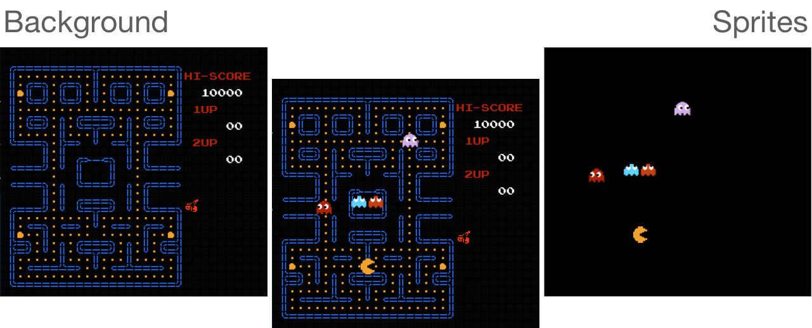
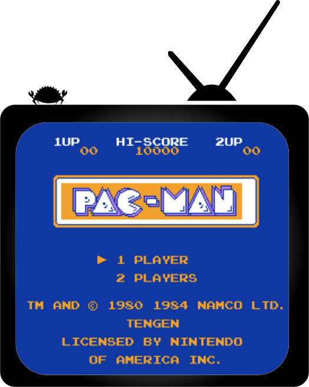
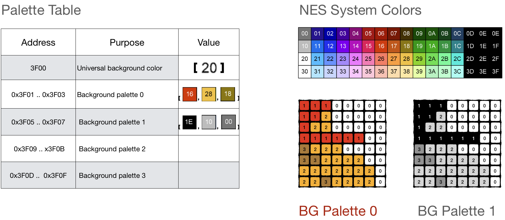
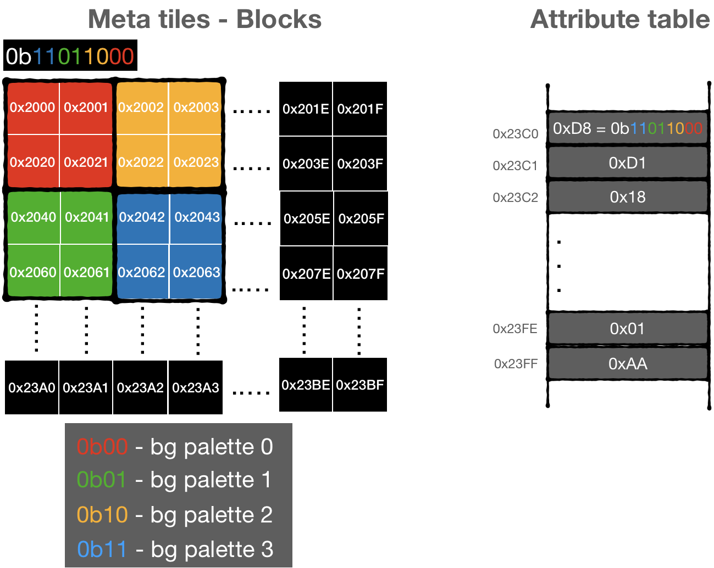
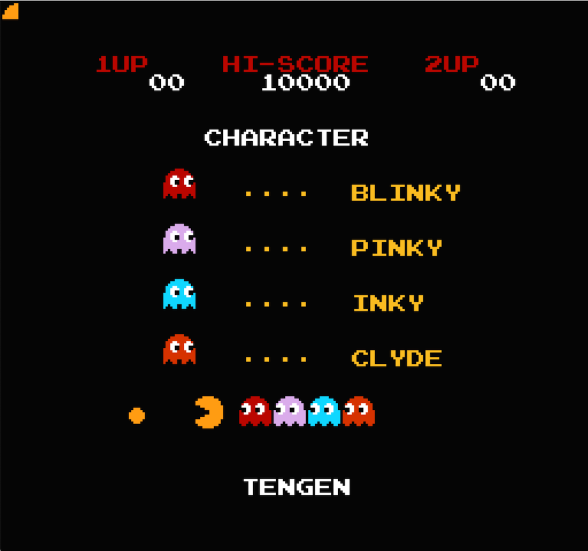

At this point, the CPU and PPU are fully functional and working in coordination with each other.
If we were to load a game into our emulator, the game would execute and most likely run into demo mode.

The problem is that we can't see what's going on inside. Remember how we had intercepted the execution of the snake game to read the game screen state? And then had it rendered via SDL2 canvas? We will have to do something similar here. It's just the data format used by NES is slightly more complicated.

PPU has to deal with 2 categories of objects:



Both of those are constructed using CHR tiles, we've discussed in the previous chapter.
In fact, the same tiles can be used both for background and for sprites.

NES uses different memory spaces to hold those categories. The set of possible transformations is also different.

## Rendering Background

<!-- <div style="text-align:center"></div> -->

Three main memory sections are responsible for the state of a background:

- Pattern Table - one of 2 banks of tiles from CHR ROM
- Nametable - the state of a screen stored in VRAM
- Palette table - the information about the real coloring of pixels, stored in internal PPU memory

NES Screen background screen is composed of 960 tiles (a tile being 8x8 pixels: `256 / 8 * 240 / 8 = 960`)
Each tile is represented by one byte in VRAM in the space called Nametable.


> Using a byte in nametable PPU can address only 256 elements within a single bank in pattern table.
> Control register decides which of two banks should be used for background (and which one should be used for sprites).
> 

In addition to 960 bytes for tiles, a nametable holds 64 bytes that specify color palette, we will discuss later. In total, a single frame is defined as 1024 bytes (960 + 64). PPU VRAM can simultaneously hold two nametables - the states of two frames.

Two additional nametables that exist in the address space of the PPU must be either mapped to existing tables or to extra RAM space on a cartridge.
[More details](http://wiki.nesdev.com/w/index.php/Mirroring).

Nametables are populated by CPU during program execution (using Addr and Data registers that we've implemented). It's entirely determined by game code. All we need to do is to read the correct part of the VRAM.

The algorithm to draw current background:

1) Determine which nametable is being used for the current screen (by reading bit 0 and bit 1 from Control register)
2) Determine which CHR ROM bank is used for background tiles (by reading bit 4 from Control Register)
3) Read 960 bytes from the specified nametable and draw a 32x30 tile-based screen

Let's add ```render``` function to a new `render` module:

```rust
pub mod frame;
pub mod palette;

use crate::ppu::NesPPU;
use frame::Frame;

pub fn render(ppu: &NesPPU, frame: &mut Frame) {
   let bank = ppu.ctrl.bknd_pattern_addr();

   for i in 0..0x03c0 { // just for now, lets use the first nametable
       let tile = ppu.vram[i] as u16;
       let tile_x = i % 32;
       let tile_y = i / 32;
       let tile = &ppu.chr_rom[(bank + tile * 16) as usize..=(bank + tile * 16 + 15) as usize];

       for y in 0..=7 {
           let mut upper = tile[y];
           let mut lower = tile[y + 8];

           for x in (0..=7).rev() {
               let value = (1 & upper) << 1 | (1 & lower);
               upper = upper >> 1;
               lower = lower >> 1;
               let rgb = match value {
                   0 => palette::SYSTEM_PALLETE[0x01],
                   1 => palette::SYSTEM_PALLETE[0x23],
                   2 => palette::SYSTEM_PALLETE[0x27],
                   3 => palette::SYSTEM_PALLETE[0x30],
                   _ => panic!("can't be"),
               };
               frame.set_pixel(tile_x*8 + x, tile_y*8 + y, rgb)
           }
       }
   }
}

```

> Note: We are still using randomly picked colors from a system palette just to see shapes

Again, we need to intercept the program execution to read the screen state.
On the real console the PPU is drawing one pixel each PPU clock cycle. However, we can take a shortcut. Instead of reading part of the screen state on each PPU clock tick, we can wait until the full screen is ready and read in one go.

> **WARNING** This is quite a drastic simplification that limits the types of games it will be possible to play on the emulator.
>
> More advanced games used a lot of tricks to enrich the gaming experience.
>
> For example, changing scroll in the middle of the frame ([split scroll](https://wiki.nesdev.com/w/index.php/PPU_scrolling#Split_X_scroll))
> or changing palette colors.
>
> This simplification wouldn't affect first-gen NES games much. The majority of NES games would require more accuracy in PPU emulation, however.

On the real console, PPU is actively drawing screen state on a TV screen during 0 - 240 scanlines; during scanlines 241 - 262, the CPU is updating the state of PPU for the next frame, then the cycle repeats.

One way to intercept is to read the screen state right after NMI interrupt - when PPU is done rendering the current frame, but before CPU starts creating the next one.

First lets add callback to the bus, that will be called every time PPU triggers NMI:

```rust
ub struct Bus<'call> {
   cpu_vram: [u8; 2048],
   prg_rom: Vec<u8>,
   ppu: NesPPU,

   cycles: usize,
   gameloop_callback: Box<dyn FnMut(&NesPPU) + 'call>,

}

impl<'a> Bus<'a> {
   pub fn new<'call, F>(rom: Rom, gameloop_callback: F) -> Bus<'call>
   where
       F: FnMut(&NesPPU) + 'call,
   {
       let ppu = NesPPU::new(rom.chr_rom, rom.screen_mirroring);

       Bus {
           cpu_vram: [0; 2048],
           prg_rom: rom.prg_rom,
           ppu: ppu,
           cycles: 0,
           gameloop_callback: Box::from(gameloop_callback),
       }
   }
}
```

Then lets tweak the ```tick``` function:

```rust
impl<'a> Bus<'a> {
//..
   pub fn tick(&mut self, cycles: u8) {
        self.cycles += cycles as usize;

        let nmi_before = self.ppu.nmi_interrupt.is_some();
        self.ppu.tick(cycles *3);
        let nmi_after = self.ppu.nmi_interrupt.is_some();

        if !nmi_before && nmi_after {
            (self.gameloop_callback)(&self.ppu, &mut self.joypad1);
        }
   }
}
```

Then we can connect gameloop, interrupt callback and render function:

```rust
fn main() {
   // init sdl2…

   //load the game
   let bytes: Vec<u8> = std::fs::read("game.nes").unwrap();
   let rom = Rom::new(&bytes).unwrap();

   let mut frame = Frame::new();

   // the game cycle
   let bus = Bus::new(rom, move |ppu: &NesPPU| {
       render::render(ppu, &mut frame);
       texture.update(None, &frame.data, 256 * 3).unwrap();

       canvas.copy(&texture, None, None).unwrap();

       canvas.present();
       for event in event_pump.poll_iter() {
           match event {
             Event::Quit { .. }
             | Event::KeyDown {
                 keycode: Some(Keycode::Escape),
                 ..
             } => std::process::exit(0),
             _ => { /* do nothing */ }
           }
        }
   });

   let mut cpu = CPU::new(bus);

   cpu.reset();
   cpu.run();
}
```

It's working! Beau·ti·ful.



Now let's fix the colors.

## Working with Colors

NES Console could generate 52 different colors on a TV screen. Those colors constitute the hardwired System Palette of the console.

However, a single screen can use only 25 colors simultaneously: 13 background colors and 12 for sprites.

NES had internal memory RAM to store palette settings.
The space is divided into 8 palettes tables: 4 for background and 4 for sprites. Each palette contains three colors.
Remember that a pixel in a tile was coded using 2 bits - that's 4 possible values. 0b00 is a special one.

> **0b00** for *background* tile means using Universal background color (stored at **0x3F00**).
>
> For *sprites* - **0b00** means that the pixel is transparent



A single tile can be drawn using only one palette from the palette table.
For background tiles, the last 64 bytes of each nametable are reserved for assigning a specific palette to a part of the background. This section is called an attribute table.

A byte in an attribute table controls palettes for 4 neighboring meta-tiles. (a meta-tile is a space composed of 2x2 tiles)
To say it another way, 1 byte controls which palettes are used for 4x4 tile blocks or 32x32 pixels
A byte is split into four 2-bit blocks and each block is assigning a background palette for four neighboring tiles.



First let's extract the palette for a background tile specified by its row and column position on the screen:

```rust
fn bg_pallette(ppu: &NesPPU, tile_column: usize, tile_row : usize) -> [u8;4] {
   let attr_table_idx = tile_row / 4 * 8 +  tile_column / 4;
   let attr_byte = ppu.vram[0x3c0 + attr_table_idx];  // note: still using hardcoded first nametable

   let pallet_idx = match (tile_column %4 / 2, tile_row % 4 / 2) {
       (0,0) => attr_byte & 0b11,
       (1,0) => (attr_byte >> 2) & 0b11,
       (0,1) => (attr_byte >> 4) & 0b11,
       (1,1) => (attr_byte >> 6) & 0b11,
       (_,_) => panic!("should not happen"),
   };

   let pallete_start: usize = 1 + (pallet_idx as usize)*4;
   [ppu.palette_table[0], ppu.palette_table[pallete_start], ppu.palette_table[pallete_start+1], ppu.palette_table[pallete_start+2]]
}
```

And just rewire our color lookup in `render` function from using randomly picked colors to the actual ones:

```rust
pub fn render(ppu: &NesPPU, frame: &mut Frame) {
   let bank = ppu.ctrl.bknd_pattern_addr();

   for i in 0..0x3c0 {
       let tile = ppu.vram[i] as u16;
       let tile_column = i % 32;
       let tile_row = i / 32;
       let tile = &ppu.chr_rom[(bank + tile * 16) as usize..=(bank + tile * 16 + 15) as usize];
       let palette = bg_pallette(ppu, tile_column, tile_row);

       for y in 0..=7 {
           let mut upper = tile[y];
           let mut lower = tile[y + 8];

           for x in (0..=7).rev() {
               let value = (1 & lower) << 1 | (1 & upper);
               upper = upper >> 1;
               lower = lower >> 1;
               let rgb = match value {
                   0 => palette::SYSTEM_PALLETE[ppu.palette_table[0] as usize],
                   1 => palette::SYSTEM_PALLETE[palette[1] as usize],
                   2 => palette::SYSTEM_PALLETE[palette[2] as usize],
                   3 => palette::SYSTEM_PALLETE[palette[3] as usize],
                   _ => panic!("can't be"),
               };
               frame.set_pixel(tile_column * 8 + x, tile_row * 8 + y, rgb)
           }
       }
   }
}
```

That's it.

## Rendering sprites

Rendering sprites is somewhat similar, but a bit easier.
NES had an internal RAM for storing states of all sprites in the frame, so-called Object Attribute Memory (OAM).

It had 256 bytes of RAM and reserved 4 bytes for each sprite. This gives an option of having 64 tiles on a screen simultaneously (but keep in mind that a single object on a screen usually consists of at least 3-4 tiles).

CPU has to option of updating OAM Table:

- using OAM Addr and OAM Data PPUT registers, updating one byte at a time.
- bulk updating the whole table by transferring 256 bytes from CPU RAM using OAM DMA

In comparison to background tiles, a sprite tile can be shown anywhere in a 256x240 screen. Each OAM record has 2 bytes reserved for X and Y coordinates, one byte is used to select a tile pattern from the pattern table. And the remaining byte specifies how the object should be drawn (for example, PPU can flip same tile horizontally or vertically)

NES Dev Wiki provides a pretty solid specification of [each byte in the OAM record](http://wiki.nesdev.com/w/index.php/PPU_OAM)

To render all visible sprites, we just need to scan through oam_data space and parse out every 4 bytes into a sprite:

```rust

pub fn render(ppu: &NesPPU, frame: &mut Frame) {

//.. draw background
//draw sprites
   for i in (0..ppu.oam_data.len()).step_by(4).rev() {
       let tile_idx = ppu.oam_data[i + 1] as u16;
       let tile_x = ppu.oam_data[i + 3] as usize;
       let tile_y = ppu.oam_data[i] as usize;

       let flip_vertical = if ppu.oam_data[i + 2] >> 7 & 1 == 1 {
           true
       } else {
           false
       };
       let flip_horizontal = if ppu.oam_data[i + 2] >> 6 & 1 == 1 {
           true
       } else {
           false
       };
       let pallette_idx = ppu.oam_data[i + 2] & 0b11;
       let sprite_palette = sprite_palette(ppu, pallette_idx);

       let bank: u16 = ppu.ctrl.sprt_pattern_addr();

       let tile = &ppu.chr_rom[(bank + tile_idx * 16) as usize..=(bank + tile_idx * 16 + 15) as usize];


       for y in 0..=7 {
           let mut upper = tile[y];
           let mut lower = tile[y + 8];
           'ololo: for x in (0..=7).rev() {
               let value = (1 & lower) << 1 | (1 & upper);
               upper = upper >> 1;
               lower = lower >> 1;
               let rgb = match value {
                   0 => continue 'ololo, // skip coloring the pixel
                   1 => palette::SYSTEM_PALLETE[sprite_palette[1] as usize],
                   2 => palette::SYSTEM_PALLETE[sprite_palette[2] as usize],
                   3 => palette::SYSTEM_PALLETE[sprite_palette[3] as usize],
                   _ => panic!("can't be"),
               };
               match (flip_horizontal, flip_vertical) {
                   (false, false) => frame.set_pixel(tile_x + x, tile_y + y, rgb),
                   (true, false) => frame.set_pixel(tile_x + 7 - x, tile_y + y, rgb),
                   (false, true) => frame.set_pixel(tile_x + x, tile_y + 7 - y, rgb),
                   (true, true) => frame.set_pixel(tile_x + 7 - x, tile_y + 7 - y, rgb),
               }
           }
       }
   }
```

The sprite palette lookup is very easy:

```rust
fn sprite_palette(ppu: &NesPPU, pallete_idx: u8) -> [u8; 4] {
    let start = 0x11 + (pallete_idx * 4) as usize;
    [
        0,
        ppu.palette_table[start],
        ppu.palette_table[start + 1],
        ppu.palette_table[start + 2],
    ]
}
```



Alright. Looks better now.

------

> The full source code for this chapter: [GitHub](https://github.com/bugzmanov/nes_ebook/tree/master/code/ch6.4)
