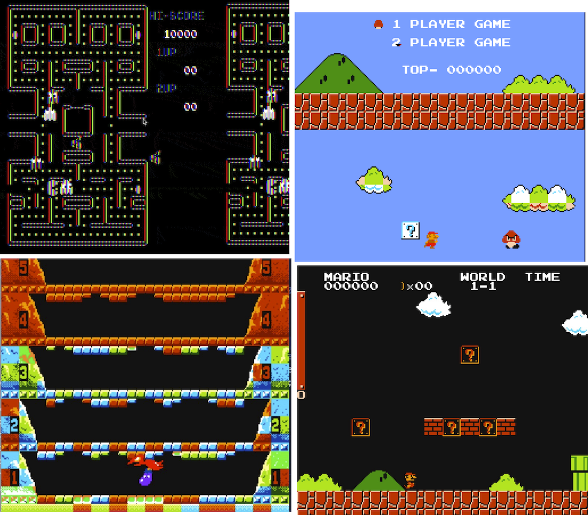

PPU 是最难模拟的，因为它负责游戏中最复杂的逻辑处理：渲染屏幕的状态。
NES PPU 有很多怪癖，虽然其中一部分是没有必要模拟的，但是也有必须要模拟的。
64KiB 的空间并不大，NES 平台设计者试图尽可能多地优化空间利用。
使用 CHR ROM 数据几乎意味着使用压缩数据格式；它需要大量的位算术、解压缩和解析。

我们将使用四个主要步骤创建 PPU 模拟器：

1. 模拟寄存器和 NMI 中断
2. 从 CHR ROM 解析和绘制图块
3. 渲染 PP U状态：
   1. 渲染背景图块
   2. 渲染精灵（Sprites）
4. 实现滚动

第一步与模拟 CPU 非常相似。在第三个步骤之后，就可以玩静态屏幕游戏了，比如：

* [Pac-Man](https://en.wikipedia.org/wiki/Pac-Man)
* [Donkey Kong](https://en.wikipedia.org/wiki/Donkey_Kong)
* [Balloon Fight](https://en.wikipedia.org/wiki/Balloon_Fight)

完成滚动实现后，我们可以玩超[级马里奥兄弟](https://en.wikipedia.org/wiki/Super_Mario_Bros)等平台游戏了。

开始吧！
